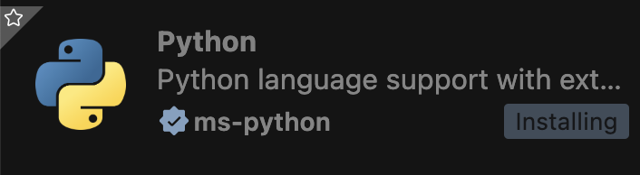
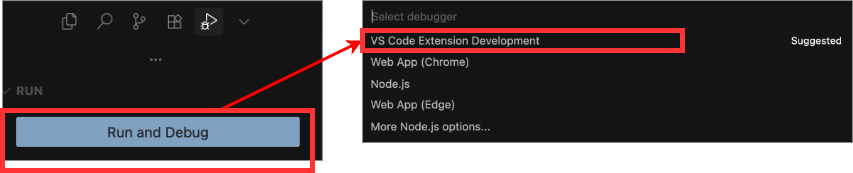
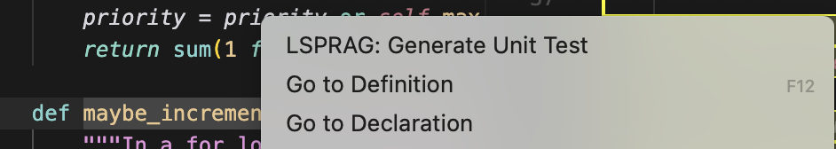
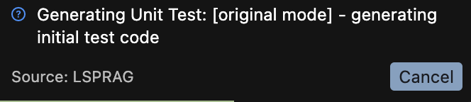
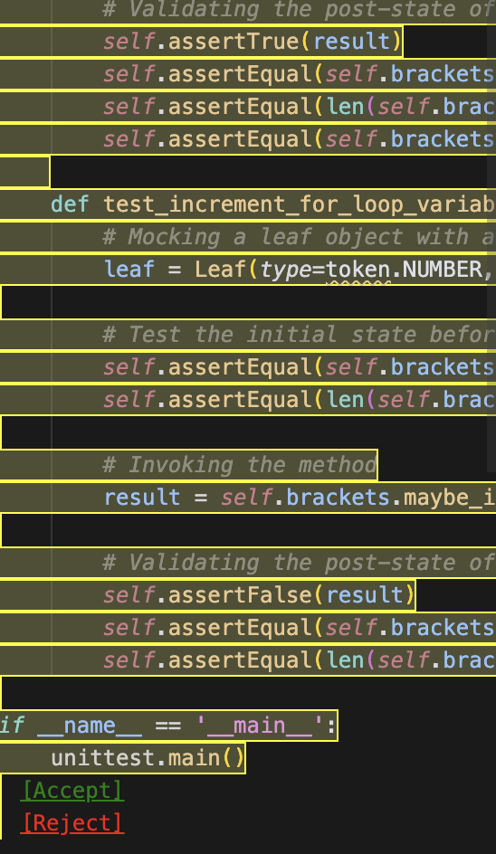

# Artifact Evaluation: LSPRAG

## Table of Contents

1. [Artifact Abstract](#artifact-abstract)
2. [Claim for Availability](#claim-for-availability)
3. [Claim for Reusability](#claim-for-reusable)
   - [Documentation](#documentation)
   - [Evidence of Reusability](#evidence-of-reusability)
   - [Installation & Setup](#installation--setup)
4. [Claim for Reproducibility](#claim-for-reproducibility)
   - [Common Setup Steps](#common-setup-steps)
   - [Optional: Experience Test Case Generation](#optional-experience-test-case-generation)
   - [Claim 1: Coverage Comparison](#claim-1-coverage-comparison)
     - [Java Projects (Commons-CLI, Commons-CSV)](#java-projects-commons-cli-commons-csv)
     - [Go Projects (Logrus, Cobra)](#go-projects-logrus-cobra)
     - [Python Projects (Black, Tornado)](#python-projects-black-tornado)
   - [Claim 2: Under-Minute Overheads](#claim-2-under-minute-overheads)
5. [Conclusion](#conclusion)

---

## Artifact Abstract

LSPRAG is a VSCode extension that leverages Language Server Protocol (LSP) for 
language-agnostic program analysis, supporting Python, C++, Java, and Go. 
The artifact includes the complete source code, test suites, evaluation scripts, 
and reproduction packages for all experiments in the paper.

**Artifact Structure:**
- `src/` - Core extension implementation
- `/src/test/suite/` - Test suites for all components
- `experiments/` - Experiment scripts and data
- `/docs/` - Documentation (setup, usage, experiment explanation)
- `ARTIFACT_STRUCTURE.md` - Detailed codebase structure and component descriptions

---

## Claim for Availability

- **Publicly Archived:** Zenodo with permanent DOI: [https://zenodo.org/records/18065707]
  - Includes source code and experiment data for reproduction
- **License:** Apache 2.0 for open reuse
- **Source Code:** https://github.com/THU-WingTecher/LSPRAG.git
- **VSCode Extension:** https://marketplace.visualstudio.com/items?itemName=LSPRAG.LSPRAG
- **Archive Contents:** Source code, datasets, scripts, and documentation

---

## Claim for Reusability

### Documentation

- `README.md` - Overview and quick start for extension users
- `QuickStart.md` - Quick start guide for software development
- `CONTRIBUTING.md` - Guide for extending to new languages and software development
- `ARCHITECTURE.md` - System design and component interaction

### Evidence of Reusability

#### Modular Design

The codebase features modular design with clear interfaces and well-developed test cases for easy adoption and extension.

#### **Verification Step: Source Code Reusability** (Follow QUICKSTART.md 🚀 5-Minute Setup)

**1. Pull Docker Container**

Pull the Docker container for robust reproduction:

```bash
docker pull gwihwan/lsprag:latest
```

**2. Start Docker Container**

```bash
docker run -it --name lsprag gwihwan/lsprag:latest /bin/bash
```

**3. Clone the Repository**

```bash
git clone https://github.com/THU-WingTecher/LSPRAG.git
cd LSPRAG
```

**4. Install Dependencies**

> **Note:** If npm is not installed, install it first.

```bash
npm install --force
npm run compile
```

**5. Install Language Server Extensions**

**For Python:**
- Install "Python" extension from VS Code Marketplace



**For Java:**
- Install "Oracle Java Extension Pack" from VS Code Marketplace

**For Go:**
- Install "Go" extension from VS Code Marketplace
- Enable semantic tokens in settings:

```json
{
  "gopls": {
    "ui.semanticTokens": true
  }
}
```

**6. Download Baseline Project**

```bash
cd experiments
mkdir projects
cd projects
git clone https://github.com/psf/black.git
```

**7. Activate Extension**

- Navigate to `src/extension.ts`
- Click "Run and Debug" and select "VS Code Extension Development"



- A **new VS Code editor** will open - use this for all subsequent actions

**8. Configure LLM Settings**

> **Critical:** Configure LLM settings in the newly opened VS Code editor (not the original one).

**Option A: VS Code Settings UI**
- Open Settings (`Ctrl/Cmd + ,`, or search for `Preference: Open User Settings`)
- Search for "LSPRAG"
- Configure provider, model, and API keys. For example:
  - `model`: "gpt-4o-mini"
  - `provider`: "openai"
  - `openai-api-key`: "sk-xxxx"

**Option B: Direct JSON Configuration**

Add the following to `settings.json`:

```json
{
  "LSPRAG": {
    "provider": "deepseek",
    "model": "deepseek-chat",
    "deepseekApiKey": "your-api-key",
    "openaiApiKey": "your-openai-key",
    "localLLMUrl": "http://localhost:11434",
    "savePath": "lsprag-tests",
    "promptType": "detailed",
    "generationType": "original",
    "maxRound": 3
  }
}
```

**Option C: Environment Variables** (for tests)

```bash
export DEEPSEEK_API_KEY="your-key"
export OPENAI_API_KEY="your-key"
export LOCAL_LLM_URL="http://localhost:11434"
```

**9. Verify Configuration**

Press `Ctrl+Shift+P` → Select `LSPRAG: Show Current Settings`

**10. Generate Tests**

**a. Open Your Baseline Project**
- Open the workspace in the new VS Code editor
- Navigate to: `LSPRAG/experiments/projects/black`
- Ensure you have already installed the Python language server in **Step 5**

**b. Generate Unit Test**
- Navigate to any function or method
- Right-click within the function definition
- Select **"LSPRAG: Generate Unit Test"** from the context menu



- Wait for generation to complete



**c. Review and Deploy**

> **Note:** Python is sensitive to environment and path settings. For better performance, you may need to manually configure the Python interpreter and Python path for improved program analysis. For simplicity, this is not covered in this quick start guide.
  
#### [Optional] **Verification Step: Easy to Extend** (Follow QUICKSTART.md 📚 Learning Path)

- The codebase includes over 8,000 lines of test code under `src/test`
- Test code is written for product robustness and is designed to be easy to follow for extension purposes
- Follow the QUICKSTART.md 📚 Learning Path to learn how we export and utilize LSP functions

#### **Off-the-Shelf Tool**

We have published LSPRAG as a VSCode extension. We encourage you to try our tool directly from the marketplace!

### Installation & Setup

#### 1. Download the Extension

Download the `LSPRAG` extension from the VS Code Marketplace.

> **Note:** Although Cursor is compatible with VSCode extensions, its extension marketplace is not completely synchronized with VS Code's. Therefore, use VS Code to download the LSPRAG extension if you plan to use it in Cursor.

#### 2. Set Up LLM in VS Code Settings

**Option A: VS Code Settings UI**
- Open Settings (`Ctrl/Cmd + ,`)
- Search for "LSPRAG"
- Configure provider, model, and API keys
- Examples:
  - Provider: `deepseek`, Model: `deepseek-chat`
  - Provider: `openai`, Model: `gpt-4o-mini` or `gpt-4o`

**Option B: Direct JSON Configuration**

Add the following settings to `.vscode/settings.json`:

```json
{
  "LSPRAG": {
    "provider": "deepseek",
    "model": "deepseek-chat",
    "deepseekApiKey": "your-api-key",
    "openaiApiKey": "your-openai-key",
    "localLLMUrl": "http://localhost:11434",
    "savePath": "lsprag-tests",
    "promptType": "detailed",
    "generationType": "original",
    "maxRound": 3
  }
}
```

#### 3. Install Language Server Extensions

**For Python:**
- Install "Pylance" and "Python" extensions from VS Code Marketplace


**For Java:**
- Install "Oracle Java Extension Pack" from VS Code Marketplace

**For Go:**
- Install "Go" extension from VS Code Marketplace
- Enable semantic tokens in settings:

```json
{
  "gopls": {
    "ui.semanticTokens": true
  }
}
```

#### 4. Open Your Project

Open any project written in Python, Java, or Go.

If you don't have a project to test with, you can clone our repository and use the demo files:

```bash
git clone https://github.com/THU-WingTecher/LSPRAG.git
```

Then navigate to the demo test files: `LSPRAG/src/test/fixtures/python`
- In the editor, click `File` → `Open Folder` → Select `LSPRAG/src/test/fixtures/python`

**[Optional] Test Core Utilities:**
- Check your current settings: `Cmd/Ctrl + Shift + P` → `LSPRAG: Show Current Settings`
- Test LLM availability: `Cmd/Ctrl + Shift + P` → `LSPRAG: Test LLM`
- Test Language Server availability: `Cmd/Ctrl + Shift + P` → `LSPRAG: Test Language Server`

#### 5. Generate Tests

- Navigate to any function or method
- Right-click within the function definition
- Select **"LSPRAG: Generate Unit Test"** from the context menu


- Wait for generation to complete


#### 6. Review & Deploy

Generated tests will appear with accept/reject options:



#### 7. Final Result

- All logs (including LLM prompts, CFG paths, and diagnostic-fix histories) will be saved under `{your-workspace}/lsprag-workspace/`
- If you click **[Accept]**, the test file will be saved at `{your-workspace}/lsprag-tests`
- You can change the save path through VS Code Extension settings (the same interface where you configured the LLM)

---

## Claim for Reproducibility

Our tool is driven by LLM and it costs lot of money. Therefore, we provide here the original data for verifying reproducibility.

### Common Setup Steps

#### 1. Pull the Image and Run

```bash
docker pull gwihwan/lsprag:latest
docker run -it -name lsprag gwihwan/lsprag:latest
docker attach lsprag
```

#### 2. Clone and Build

```bash
git clone https://github.com/THU-WingTecher/LSPRAG.git
cd LSPRAG

# Install dependencies
npm install

# Build the extension
npm run compile
```

**Known Issues:** If you met the below error while compiling:

```bash
node_modules/lru-cache/dist/commonjs/index.d.ts:1032:5 - error TS2416: Property 'forEach' in type 'LRUCache<K, V, FC>' is not assignable to the same property in base type 'Map<K, V>'.node_modules/lru-cache/dist/commonjs/index.d.ts:1032:5 - error TS2416: Property 'forEach' in type 'LRUCache<K, V, FC>' is not assignable to the same property in base type 'Map<K, V>'.
```

You can try to downgrade the version of lru-cache to 10.1.0 by running the following command:

```bash
npm install lru-cache@10.1.0
```

#### 3. Download Existing Dataset

```bash 
cd /LSPRAG
wget --no-check-certificate "https://cloud.tsinghua.edu.cn/f/0910553cfe484f2d9a1c/?dl=1" -O experimentData.tar.gz
tar xvfz experimentData.tar.gz
```

### Optional: Experience Test Case Generation

Below is the process that experience our test case generation process. If you directly jump to reproducibility verification, move to [Claim 1](#claim-1-coverage-comparison).

#### 1. Set the LLM Options for Test Case Generation

Create `.env.sh` file with below configurations:

```bash
# export https_proxy=http://127.0.0.1:23312
# export http_proxy=http://127.0.0.1:23312
export OPENAI_MODEL_NAME="gpt-5-mini"
export OPENAI_API_KEY="sk-"
export DEEPSEEK_API_KEY="sk-"
```

#### 2. Activate .env.sh File

```bash
source .env.sh
```

#### 3. Experience Test Case Generation Process

For Java test cases:

```bash
npm run test --testFile=exp.fixtures.java
```

For Python test cases:

```bash
npm run test --testFile=exp.fixtures.python
```

**Known issues1:** For ssh-remote environment, you should add `xvfb-run -a` before `npm run test`. For example, `xvfb-run -a npm run test --testFile=exp.fixtures.python`

**Known issues2:** 'libgtk-3.so.0: cannot open shared object file: No such file or directory\n'. You may need run `apt-get install -y libgtk-3-0 libxss1 libasound2 libgbm1`

For ssh-remote environment, you should add `xvfb-run -a` before `npm run test`. For example, `xvfb-run -a npm run test --testFile=exp.fixtures.python`

#### 4. Checkout Generated Test Files

There will be all logs including llm logs, cfg paths, iteration history, and final test case at `/LSPRAG/src/test/fixtures/java/lsprag-workspace/{current_time}` or `/LSPRAG/src/test/fixtures/python/lsprag-workspace/{current_time}`

---

## Claim 1: Coverage Comparison

**Can "LSPRAG" generate higher coverage unit tests than other baselines?**

Now, let's start to reproduce the experiment demonstrated in our paper. For the first, at Table 3, we compared the line coverage and valid rate across all baselines. This process contains multiple programming languages, we first start with Java.

### Java Projects (Commons-CLI, Commons-CSV)

#### Java Setup

Ensure that you download the necessary libraries from the provided link:

```bash
# Download required libraries
cd /LSPRAG/scripts
wget --no-check-certificate "https://cloud.tsinghua.edu.cn/f/efade5fc56a54ee59ed1/?dl=1" -O ../javaLib.tar.gz
tar xvf ../javaLib.tar.gz
```

After running above commands, you can observe that jar files are located at `/LSPRAG/scripts/lib/`.

```bash
|-- lib
|   |-- jacocoagent.jar
|   |-- jacococli.jar
|   |-- junit-jupiter-api-5.11.2.jar
|   |-- junit-jupiter-engine-5.11.2.jar
|   |-- junit-platform-console-standalone-1.8.2.jar
|   `-- junit-platform-launcher-1.8.2.jar
```

Once the environment is set up and the unit tests are prepared, you can proceed to reproduce experiments using the provided dataset.

If you want to generate test cases for java project, you should add below setting to `pom.xml` for static diagnostic report generation.
```bash
  <build>
    <defaultGoal>clean verify apache-rat:check japicmp:cmp checkstyle:check spotbugs:check pmd:check javadoc:javadoc</defaultGoal>
    <testSourceDirectory>src/test/java</testSourceDirectory>
    <testResources>
        <testResource>
              <directory>src/test/resources</directory>
        </testResource>
    </testResources>
    <testSourceDirectory>src/lsprag/test/java</testSourceDirectory>
    <plugins> <-- it should be right after <testSourceDirectory>
      <plugin>
        <groupId>org.codehaus.mojo</groupId>
        <artifactId>build-helper-maven-plugin</artifactId>
        <version>3.2.0</version>
        <executions>
          <execution>
            <id>add-test-source</id>
            <phase>generate-test-sources</phase>
            <goals>
              <goal>add-test-source</goal>
            </goals>
            <configuration>
              <sources>
                <source>src/lsprag/test/java</source>
              </sources>
            </configuration>
          </execution>
        </executions>
      </plugin>
    </plugins>
    ...
  </build>
```

mvn install -DskipTests -Drat.skip=true

change the workspace to other java project, and come back.
#### Commons-CLI Project Setup

To set up the CLI project, follow these steps:

```bash
# Clone and checkout a specific version
mkdir -p /LSPRAG/experiments/projects
cd /LSPRAG/experiments/projects
git clone https://github.com/apache/commons-cli.git
cd commons-cli

# Java Setup - This step is required for coverage analysis
mvn install -DskipTests -Drat.skip=true
mvn dependency:copy-dependencies
```

##### Reproduce Experiment Results

To reproduce the experiment results, execute the following commands one by one and check the output. This script loads the generated unit tests from all baselines stored under `experiments/data` and prints the results in CSV format.

Run the following command:

```bash
python3 scripts/result_verifier.py /LSPRAG/experiments/data/main_result/commons-cli
```

**Expected Result:**

```
CODES (5/5 results):
  codes: Coverage=0.1518  ValidRate=0.1136 
  codes: Coverage=0.1850  ValidRate=0.1591 
  codes: Coverage=0.1599  ValidRate=0.1136 
  codes: Coverage=0.1656  ValidRate=0.1364 
  codes: Coverage=0.1650  ValidRate=0.1364 
  Average Coverage: 0.1655 (5/5 data points)
  Average Valid Rate: 0.1318 (5/5 data points)

====================================================================================================
COVERAGE RESULTS SUMMARY (CSV FORMAT)
====================================================================================================
project codeQA  StandardRAG     Naive   SymPrompt       LSPRAG  DraCo   LSPRAG-nofix
cli-4o-mini     0.243842616     0.165457333     0.180684722     0.087480838     0.424833929  None     0.315380685
cli-4o  0.208584568     0.042207460     0.188656106     0.170567195     0.430659172     None 0.329586101
cli-deepseek    0.288400613     0.180582524     0.186407767     0.086254471     0.447317322  None     0.298824732

====================================================================================================
VALID RATE RESULTS SUMMARY (CSV FORMAT)
====================================================================================================
project codeQA  StandardRAG     Naive   SymPrompt       LSPRAG  DraCo   LSPRAG-nofix
cli-4o-mini     0.284848485     0.131818182     0.405908234     0.141043369     0.851291990  None     0.345116279
cli-4o  0.243073593     0.104545455     0.586423633     0.268007542     0.911839323     None 0.456744186
cli-deepseek    0.228787879     0.163636364     0.414456317     0.185865633     0.852653548  None     0.331576227
# Warning: openpyxl not installed. Excel files will not be generated.
# Install with: pip install openpyxl

# Files saved:
# Coverage results: coverage_results_20250719_052404.csv
# Valid rate results: validrate_results_20250719_052404.csv
```

#### Commons-CSV Project Setup

To set up the CSV project, follow these steps:

```bash
# Clone and checkout a specific version
mkdir -p /LSPRAG/experiments/projects
cd /LSPRAG/experiments/projects
git clone https://github.com/apache/commons-csv.git
cd commons-csv

# Java Setup
mvn install -DskipTests -Drat.skip=true
mvn dependency:copy-dependencies
```

##### Reproduce Experiment Results

To reproduce the experiment results, execute the following commands one by one and check the output. This script loads the generated unit tests from all baselines stored under `experiments/data` and prints the results in CSV format.

Run the following command:

```bash
python3 scripts/result_verifier.py /LSPRAG/experiments/data/main_result/commons-csv
```

**Expected Result:**

```
# commons-csv + gpt-4o-mini + standard
# --------------------------------------------------------------------------------

# CODES (5/5 results):
#   codes: Coverage=0.2538  ValidRate=0.1156 
#   codes: Coverage=0.2530  ValidRate=0.1361 
#   codes: Coverage=0.2474  ValidRate=0.1429 
#   codes: Coverage=0.2450  ValidRate=0.1224 
#   codes: Coverage=0.2474  ValidRate=0.1429 
#   Average Coverage: 0.2493 (5/5 data points)
#   Average Valid Rate: 0.1320 (5/5 data points)

COVERAGE RESULTS SUMMARY (CSV FORMAT)
====================================================================================================
====================================================================================================
project codeQA  StandardRAG     Naive   SymPrompt       LSPRAG  DraCo   LSPRAG-nofix
csv-4o-mini     0.407959184     0.251755102     0.262367347     0.181224490     0.816979592     None    0.703836735
csv-4o  0.448489796     0.452408163     0.391510204     0.251755102     0.854857143     None    0.764734694
csv-deepseek    0.660897959     0.450285714     0.323428571     0.347428571     0.844244898     None    0.759673469

====================================================================================================
VALID RATE RESULTS SUMMARY (CSV FORMAT)
====================================================================================================
project codeQA  StandardRAG     Naive   SymPrompt       LSPRAG  DraCo   LSPRAG-nofix
csv-4o-mini     0.236394558     0.131972789     0.157402076     0.062799189     0.828468893     None    0.374321570
csv-4o  0.206802721     0.265306122     0.356853030     0.144110886     0.908976571     None    0.544464519
csv-deepseek    0.432653061     0.322448980     0.367579511     0.298242055     0.909500010     None    0.492918639 -->

# Files saved:
#   Coverage results: coverage_results_20250719_055246.csv
#   Valid rate results: validrate_results_20250719_055246.csv
#   Excel results: test_results_20250719_055246.xlsx
```

### Go Projects (Logrus, Cobra)

#### Logrus Project Setup

To set up the Logrus project, follow these steps:

```bash
# Clone and checkout a specific version
mkdir -p /LSPRAG/experiments/projects
cd /LSPRAG/experiments/projects
git clone https://github.com/sirupsen/logrus.git
cd logrus
# Optional: Checkout specific commit (if applicable)
# git checkout <specific_version>

# Go Setup
go env -w GOPROXY=https://goproxy.io,direct
go mod tidy
```

##### Reproduce Experiment Results

To reproduce the experiment results, execute the following commands one by one and check the output. This script loads the generated unit tests from all baselines stored under `experiments/data` and prints the results in CSV format.

Run the following command:

```bash
cd /LSPRAG
python3 scripts/result_verifier.py /LSPRAG/experiments/data/main_result/logrus
```

**Expected Result:**

```
#   Average Coverage: 0.1100 (5/5 data points)
#   Average Valid Rate: 0.1583 (5/5 data points)

# ====================================================================================================
# COVERAGE RESULTS SUMMARY (CSV FORMAT)
# ====================================================================================================
# project codeQA  StandardRAG     Naive   SymPrompt       LSPRAG  DraCo   LSPRAG-nofix
# logrus-4o-mini  0.055220418     0.111368910     0.023201856     0.002320186     0.237122970     None    0.115545244
# logrus-4o       0.056148492     0.130858469     0.006496520     0.002320186     0.277494200     None    0.105800464
# logrus-deepseek 0.113369024     0.109976798     0.106728538     0.054292343     0.218097448     None    0.135498840

# ====================================================================================================
# VALID RATE RESULTS SUMMARY (CSV FORMAT)
# ====================================================================================================
# project codeQA  StandardRAG     Naive   SymPrompt       LSPRAG  DraCo   LSPRAG-nofix
# logrus-4o-mini  0.143181818     0.208333333     0.033333333     0.008333333     0.340151515     None    0.188636364
# logrus-4o       0.141666667     0.265217391     0.008333333     0.008333333     0.320238095     None    0.150000000
# logrus-deepseek 0.133333333     0.158333333     0.225000000     0.075000000     0.331060606     None    0.170454545

# Files saved:
#   Coverage results: coverage_results_20250719_061138.csv
#   Valid rate results: validrate_results_20250719_061138.csv
#   Excel results: test_results_20250719_061138.xlsx
```

#### Cobra Project Setup

To set up the Cobra project, follow these steps:

```bash
# Clone and checkout a specific version
mkdir -p /LSPRAG/experiments/projects
cd /LSPRAG/experiments/projects
git clone https://github.com/spf13/cobra.git
cd cobra
# Optional: Checkout specific commit (if applicable)
# git checkout <specific_version>

# Go Setup
go env -w GOPROXY=https://goproxy.io,direct
go mod tidy
```

##### Reproduce Experiment Results

To reproduce the experiment results, execute the following commands one by one and check the output. This script loads the generated unit tests from all baselines stored under `experiments/data` and prints the results in CSV format.

Run the following command:

```bash
python scripts/result_verifier.py /LSPRAG/experiments/data/main_result/cobra
```

**Expected Result:**

```
#   codes: Coverage=0.0635  ValidRate=0.0891 
#   Average Coverage: 0.0757 (5/5 data points)
#   Average Valid Rate: 0.0812 (5/5 data points)

====================================================================================================
COVERAGE RESULTS SUMMARY (CSV FORMAT)
====================================================================================================
project codeQA  StandardRAG     Naive   SymPrompt       LSPRAG  DraCo   LSPRAG-nofix
cobra-4o-mini   0.071143376     0.120326679     0.013611615     0.033938294     0.149727768     None    0.099092559
cobra-4o        0.100544465     0.075680581     0.027223230     0.000907441     0.218148820     None    0.080762250
cobra-deepseek  0.154990926     0.130127042     0.115789474     0.085662432     0.372232305     None    0.256079855

====================================================================================================
VALID RATE RESULTS SUMMARY (CSV FORMAT)
====================================================================================================
project codeQA  StandardRAG     Naive   SymPrompt       LSPRAG  DraCo   LSPRAG-nofix
cobra-4o-mini   0.060080808     0.095049505     0.011940594     0.012293729     0.150495050     None    0.071261073
cobra-4o        0.097029703     0.081188119     0.017861386     0.006146865     0.263366337     None    0.053465347
cobra-deepseek  0.102970297     0.106930693     0.091267327     0.027847837     0.346534653     None    0.217821782

# Files saved:
#   Coverage results: coverage_results_20250719_060223.csv
#   Valid rate results: validrate_results_20250719_060223.csv
```

### Python Projects (Black, Tornado)

#### Python Setups

  Step 1: Download the Miniconda Installer

  Navigate to a temporary directory and download the latest Miniconda installer:

  ```bash
  cd /tmp
  wget https://repo.anaconda.com/miniconda/Miniconda3-latest-Linux-x86_64.sh
  ```

  **Alternative using curl:**
  ```bash
  cd /tmp
  curl -O https://repo.anaconda.com/miniconda/Miniconda3-latest-Linux-x86_64.sh
  ```

  ### Step 2: Run the Installer

  Execute the installer script in batch mode (non-interactive):

  ```bash
  bash Miniconda3-latest-Linux-x86_64.sh -b -p $HOME/miniconda3
  ```

  **Installation options:**
  - `-b`: Batch mode (non-interactive installation)
  - `-p $HOME/miniconda3`: Specify installation path (default is `$HOME/miniconda3`)

  **For interactive installation** (allows you to choose installation path):
  ```bash
  bash Miniconda3-latest-Linux-x86_64.sh
  ```

  ### Step 3: Initialize Conda

  Initialize conda for your shell (bash):

  ```bash
  $HOME/miniconda3/bin/conda init bash
  ```

  This command modifies your `~/.bashrc` file to automatically set up conda when you open a new terminal.

  **For other shells:**
  - **zsh**: `$HOME/miniconda3/bin/conda init zsh`
  - **fish**: `$HOME/miniconda3/bin/conda init fish`
  - **tcsh**: `$HOME/miniconda3/bin/conda init tcsh`

  ### Step 4: Activate Conda

  **Option A: Start a new terminal session**
  - Close and reopen your terminal - conda will be automatically available

  **Option B: Source your current shell**
  ```bash
  source ~/.bashrc
  ```

  **Option C: Use conda directly (without initialization)**
  ```bash
  $HOME/miniconda3/bin/conda --version
  ```

  ### Step 5: Verify Installation

  Verify that conda is installed correctly:

  ```bash
  conda --version
  ```

  You should see output like: `conda 25.11.1` (version number may vary)

  ## Post-Installation

  ### Update Conda (Recommended)

  After installation, update conda to the latest version:

  ```bash
  conda update conda
  ```

  ### Clean Up

  Remove the installer file if no longer needed:

  ```bash
  rm /tmp/Miniconda3-latest-Linux-x86_64.sh
  ```

#### Black Project Setup

To set up the Black project, follow these steps:

```bash
# Clone and checkout specific version
mkdir -p /LSPRAG/experiments/projects
cd /LSPRAG/experiments/projects
git clone https://github.com/psf/black.git
cd /LSPRAG/experiments/projects/black
git checkout 8dc912774e322a2cd46f691f19fb91d2237d06e2

# Python Setup
conda create -n black python=3.10
conda activate black

# Install dependencies
pip install coverage pytest pytest-json-report 
pip install -r docs/requirements.txt
pip install -r test_requirements.txt
pip install click mypy_extensions packaging urllib3 pathspec platformdirs aiohttp

# Configure project
echo "version = '00.0.0'" > src/black/_black_version.py
rm pyproject.toml
```

##### Reproduce Experiment Results

Python is sensitive to environment and path, and it is hard to reproduce the result through one-click script. 
Therefore, we recommend you to run below commands and checkout whether it is same with expected output.
Run the following command:

Run dataset of LSPRAG baseline with gpt-4o
```bash
conda activate black
cd /LSPRAG
bash scripts/python_coverage.bash /LSPRAG/experiments/projects/black /LSPRAG/experiments/data/main_result/black/lsprag/2/gpt-4o/results/final
```
Expected output: (Python coverage may slightly differ everytime you run)
```
src/blib2to3/pygram.py               153      0   100%
src/blib2to3/pytree.py               475    234    51%
------------------------------------------------------
TOTAL                               7261   3660    50%
Coverage collection completed. Summary saved to /LSPRAG/experiments/data/main_result/black/lsprag/2/gpt-4o/results/final-report/summary.txt
PassRate ((passed files + failed files)/ total files): 251/299
```

Run dataset of DraCo baseline with gpt-4o
```bash
conda activate black
cd /LSPRAG
bash scripts/python_coverage.bash /LSPRAG/experiments/projects/black /LSPRAG/experiments/data/main_result/black/draco/DraCo_gpt-4o_20250706_234105/codes
```
Expected output: (Python coverage may slightly differ everytime you run)
```
src/blib2to3/pytree.py               475    251    47%
------------------------------------------------------
TOTAL                               7182   4615    36%
Coverage collection completed. Summary saved to /LSPRAG/experiments/data/main_result/black/draco/DraCo_gpt-4o_20250706_234105/codes-report/summary.txt
PassRate ((passed files + failed files)/ total files): 236/299
```

Run dataset of codeQA baseline with gpt-4o
```bash
conda activate black
cd /LSPRAG
bash scripts/python_coverage.bash /LSPRAG/experiments/projects/black /LSPRAG/experiments/data/main_result/black/code_qa/codeQA_gpt-4o_20250707_145404/codes
```
Expected output: (Python coverage may slightly differ everytime you run)
```
src/blib2to3/pytree.py               475    242    49%
------------------------------------------------------
TOTAL                               7182   4584    36%
Coverage collection completed. Summary saved to /LSPRAG/experiments/data/main_result/black/code_qa/codeQA_gpt-4o_20250707_145404/codes-report/summary.txt
PassRate ((passed files + failed files)/ total files): 237/299
```


#### Tornado Project Setup

To set up the Tornado project, follow these steps:

```bash
mkdir -p /LSPRAG/experiments/projects
cd /LSPRAG/experiments/projects
git clone https://github.com/tornadoweb/tornado.git
cd /LSPRAG/experiments/projects/tornado

# Python Setup
conda create -n tornado python=3.10
conda activate tornado

# Install dependencies
# Don't forget to activate venv environment
pip install coverage pytest pytest-json-report
pip install -r requirements.txt
```

##### Reproduce Experiment Results

Python is sensitive to environment and path, and it is hard to reproduce the result through one-click script. 
Therefore, we recommend you to run below commands and checkout whether it is same with expected output.
Run the following command:

Run dataset of LSPRAG baseline with gpt-4o
```bash
conda activate tornado
cd /LSPRAG
bash scripts/python_coverage.bash /LSPRAG/experiments/projects/tornado /LSPRAG/experiments/data/main_result/tornado/lsprag/1/gpt-4o/results/final
```
Expected output: (Python coverage may slightly differ everytime you run)
```
tornado/websocket.py             721    491    214      4    27%
tornado/wsgi.py                   93      8     28      4    88%
----------------------------------------------------------------
TOTAL                           8885   3239   3038    426    59%
Coverage collection completed. Summary saved to /LSPRAG/experiments/data/main_result/tornado/lsprag/1/gpt-4o/results/final-report/summary.txt
PassRate ((passed files + failed files)/ total files): 418/521
```

Run dataset of DraCo baseline with gpt-4o
```bash
conda activate tornado
cd /LSPRAG
bash scripts/python_coverage.bash /LSPRAG/experiments/projects/tornado /LSPRAG/experiments/data/main_result/tornado/draco/DraCo_gpt-4o_20250707_160231/codes
```
Expected output: (Python coverage may slightly differ everytime you run)
```
tornado/websocket.py             721    558    214      0    17%
tornado/wsgi.py                   93     93     28      0     0%
----------------------------------------------------------------
TOTAL                           8885   5818   3038    179    29%
Coverage collection completed. Summary saved to /LSPRAG/experiments/data/main_result/tornado/draco/DraCo_gpt-4o_20250707_160231/codes-report/summary.txt
PassRate ((passed files + failed files)/ total files): 445/522
```

Run dataset of codeQA baseline with gpt-4o
```bash
conda activate tornado
cd /LSPRAG
bash scripts/python_coverage.bash /LSPRAG/experiments/projects/tornado /LSPRAG/experiments/data/main_result/tornado/code_qa/codeQA_gpt-4o_20250706_101135/codes
```
Expected output: (Python coverage may slightly differ everytime you run)
```
tornado/websocket.py             721    559    214      0    17%
tornado/wsgi.py                   93     93     28      0     0%
----------------------------------------------------------------
TOTAL                           8885   6137   3038    151    25%
Coverage collection completed. Summary saved to /LSPRAG/experiments/data/main_result/tornado/code_qa/codeQA_gpt-4o_20250706_101135/codes-report/summary.txt
PassRate ((passed files + failed files)/ total files): 403/522
```


#### Mimesis Project Setup

To set up the Tornado Mimesis, follow these steps:

```bash
mkdir -p /LSPRAG/experiments/projects
cd /LSPRAG/experiments/projects
git clone https://github.com/lk-geimfari/mimesis.git
cd /LSPRAG/experiments/projects/mimesis

# Python Setup
conda create -n mimesis python=3.10
conda activate mimesis

# Install dependencies
# Don't forget to activate venv environment
git checkout 876b9398

pip install coverage pytest pytest-json-report
pip install 'pytest~=7.2' 'pytest-mock~=3.10' 'requests~=2.28' 'mypy~=1.1' 'colorama>=0.4.6,<0.5' 'pygments~=2.13' 'pytest-randomly~=3.12' 'pytz~=2023.3' 'black>=22.10,<24.0' 'autoflake~=2.0' 'types-pytz~=2023.3' 'taskipy>=1.10.1,<2' 'validators>=0.20.0,<0.21' 'pytest-repeat>=0.9.1,<0.10' 'coverage>=7.2.3,<8' 'pytest-cov>=4.0.0,<5' 'Sphinx>=5.1.1,<8.0.0' 'sphinx-copybutton>=0.5.0,<0.6' 'sphinx-autodoc-typehints>=1.19.2,<2' 'pytest-factoryboy>=2.6.0,<3' 'isort>=6.0.1' 'twine>=6.1.0'
pytest # for checking whether the setting is complete
```

#### dataclasses-json Project Setup

To set up the Tornado Mimesis, follow these steps:

```bash
mkdir -p /LSPRAG/experiments/projects
cd /LSPRAG/experiments/projects
git clone https://github.com/lidatong/dataclasses-json.git
cd /LSPRAG/experiments/projects/dataclasses-json

# Python Setup
conda create -n dataclasses-json python=3.10
conda activate dataclasses-json

# Install dependencies
# Don't forget to activate venv environment
git checkout dc63902

pip install coverage pytest pytest-json-report
pip install -e . 
pip install mypy hypothesis 
pytest # for checking whether the setting is complete
```

---

#### tqdm Project Setup

To set up the Tornado Mimesis, follow these steps:

```bash
mkdir -p /LSPRAG/experiments/projects
cd /LSPRAG/experiments/projects
git clone https://github.com/tqdm/tqdm.git
cd /LSPRAG/experiments/projects/tqdm

# Python Setup
conda create -n tqdm python=3.10
conda activate tqdm

# Install dependencies
# Don't forget to activate venv environment
git checkout 0ed5d7f

pip install coverage pytest pytest-json-report
pip install -e ".[dev]" 
pytest # for checking whether the setting is complete
```

---

#### TheFuck Project Setup

To set up the Thefuck, follow these steps:

```bash
mkdir -p /LSPRAG/experiments/projects
cd /LSPRAG/experiments/projects
git clone https://github.com/tqdm/tqdm.git
cd /LSPRAG/experiments/projects/tqdm

# Python Setup
git checkout c7e7e1d
conda create -n thefuck python=3.8
conda activate thefuck
pip install -r requirements.txt
python setup.py develop 
pip install coverage pytest pytest-json-report

pytest # for checking whether the setting is complete # there will be a symbol named "get_valid_history_without_current" that do not pass unit test 
```

#### Python-Semantic-Release Project Setup

To set up the Thefuck, follow these steps:

```bash
mkdir -p /LSPRAG/experiments/projects
cd /LSPRAG/experiments/projects
git clone https://github.com/tqdm/tqdm.git
cd /LSPRAG/experiments/projects/tqdm

# Python Setup
git checkout 95ce7ec
conda create -n python-semantic-release python=3.8
conda activate python-semantic-release
pip install -e .[dev,mypy,test]
pytest 
```

---


#### Youtube-dl Project Setup

To set up the coocki-cutter, follow these steps:

```bash
cd /LSPRAG/experiments/projects
git clone https://github.com/ytdl-org/youtube-dl.git

# Python Setup
# (env already existed)
git checkout 
conda create -n youtube-dl python=3.10
conda activate youtube-dl

pip install -U pip setuptools wheel
pip install -e .
pip install pytest nose pynose brotli pycryptodome

# Test run (as requested)
unset HTTP_PROXY HTTPS_PROXY ALL_PROXY http_proxy https_proxy all_proxy
export NO_PROXY=127.0.0.1,localhost
pytest test \
  --ignore=test/test_download.py \
  --ignore=test/test_age_restriction.py \
  --ignore=test/test_subtitles.py \
  --ignore=test/test_write_annotations.py \
  --ignore=test/test_youtube_lists.py \
  --ignore=test/test_iqiyi_sdk_interpreter.py \
  --ignore=test/test_socks.py
```

## Claim 2: Under-Minute Overheads

**"LSPRAG" has under-minute overheads.**

### Reproduce Experiment Results (Table 4)

In this section, we reproduce the experiment results of Table 4, focusing on the tokens used and the time taken. LSPRAG generates log files when generating test files, and based on these log files, we summarize and analyze the costs associated with LSPRAG's operations.

Before proceeding, make sure you have already downloaded the provided dataset as described in this section (#option-b-use-pre-generated-dataset-recommended).

To reproduce Table 4 (CLI && CSV project with gpt-4o), you should run below command:

```bash
python3 scripts/anal_cost.py /LSPRAG/experiments/data/cost-data/commons-cli/logs/gpt-4o /LSPRAG/experiments/data/cost-data/commons-csv/logs/gpt-4o
```

**Expected Result:**

```
=== Overall Statistics (across ALL directories) ===

Total Files Processed: 188
Total Time Used (ms): 4740861
Total Tokens Used: 1014672
Total FixWithLLM Tokens Used: 611481
Total FixWithLLM Processes Run: 156
Average Time per Function (ms): 25217.35
Average Tokens per Function: 5397.19
Average FixWithLLM Time per Function (ms): 9350.85  -> FIX Time
Average FixWithLLM Tokens per Function: 3252.56   -> FIX Token
Average Fix Processes per Function: 0.83  -> FIX Processes

=== Average Time and Token Usage per Process ===

Process                          Avg Time (ms)      Avg Tokens
-----------------------------------------------------------------
FixWithLLM_1                          11315.53         4482.89 
FixWithLLM_2                          11278.86         2949.28 
FixWithLLM_3                          11122.94         3531.50 
FixWithLLM_4                          11839.33         4950.92 
FixWithLLM_5                          10413.60         1296.30 
buildCFG                                  0.95            0.00 
collectCFGPaths                           2.26            0.00 
fixDiagnostics                        14173.65            0.00 
gatherContext                           695.24            0.00 
gatherContext-1                         417.98            0.00   ->  Retrieval(def)
gatherContext-2                         277.26            0.00   ->  Retrieval(ref)
generateTest                          11433.18         2144.63   ->  Gen
getContextTermsFromTokens              2072.80            0.00 
getDiagnosticsForFilePath              3590.28            0.00   ->  getDiagnostic
saveGeneratedCodeToFolder                 1.36            0.00 
Average Total Time Used (ms): 25217.34574468085
Average Total Tokens Used: 5397.191489361702

Done.

PASTE BELOW DICTIONARY TO scripts/plot_cost.py
{'fix': 9350.845744680852, 'gen': 11433.18085106383, 'cfg': 3.202127659574468, 'def': 417.97872340425533, 'ref': 277.25531914893617, 'filter': 2072.7978723404253, 'diag': 3590.2758620689656, 'save': 1.3563218390804597}
```

**For Go Projects:**

```bash
python3 scripts/anal_cost.py /LSPRAG/experiments/data/cost-data/cobra/logs/gpt-4o /LSPRAG/experiments/data/cost-data/logrus/logs/gpt-4o
```

**Expected Result:**

```
=== Overall Statistics (across ALL directories) ===

Total Files Processed: 125
Total Time Used (ms): 4879365
Total Tokens Used: 604827
Total FixWithLLM Tokens Used: 182358
Total FixWithLLM Processes Run: 119
Average Time per Function (ms): 39034.92
Average Tokens per Function: 4838.62
Average FixWithLLM Time per Function (ms): 13101.34  -> FIX Time
Average FixWithLLM Tokens per Function: 1458.86   -> FIX Token
Average Fix Processes per Function: 0.95  -> FIX Processes

=== Average Time and Token Usage per Process ===

Process                          Avg Time (ms)      Avg Tokens
-----------------------------------------------------------------
FixWithLLM_1                          14490.76         1542.74 
FixWithLLM_2                          12549.68         1567.39 
FixWithLLM_3                          12369.42         1439.08 
FixWithLLM_4                          14863.00         1162.00 
FixWithLLM_5                          13015.00         1175.00 
buildCFG                                  2.98            0.00 
collectCFGPaths                         342.00            0.00 
fixDiagnostics                        18209.94            0.00 
gatherContext                          2496.11            0.00 
gatherContext-1                        2251.74            0.00   ->  Retrieval(def)
gatherContext-2                         244.38            0.00   ->  Retrieval(ref)
generateTest                          18576.68         3379.75   ->  Gen
getContextTermsFromTokens              2334.06            0.00 
getDiagnosticsForFilePath              3575.64            0.00   ->  getDiagnostic
saveGeneratedCodeToFolder               109.77            0.00 
Average Total Time Used (ms): 39034.92
Average Total Tokens Used: 4838.616

Done.

PASTE BELOW DICTIONARY TO scripts/plot_cost.py
{'fix': 13101.336, 'gen': 18576.68, 'cfg': 344.976, 'def': 2251.736, 'ref': 244.376, 'filter': 2334.056, 'diag': 3575.635135135135, 'save': 109.77027027027027}
```

**For Python Projects:**

```bash
python3 scripts/anal_cost.py /LSPRAG/experiments/data/cost-data/tornado/logs/gpt-4o /LSPRAG/experiments/data/cost-data/black/logs/gpt-4o
```

**Expected Result:**

```
=== Overall Statistics (across ALL directories) ===

Total Files Processed: 820
Total Time Used (ms): 22418370
Total Tokens Used: 2674289
Total FixWithLLM Tokens Used: 481040
Total FixWithLLM Processes Run: 323
Average Time per Function (ms): 27339.48
Average Tokens per Function: 3261.33
Average FixWithLLM Time per Function (ms): 5591.81  -> FIX Time
Average FixWithLLM Tokens per Function: 586.63   -> FIX Token
Average Fix Processes per Function: 0.39  -> FIX Processes

=== Average Time and Token Usage per Process ===

Process                          Avg Time (ms)      Avg Tokens
-----------------------------------------------------------------
FixWithLLM_1                          13918.80         1523.17 
FixWithLLM_2                          15696.09         1289.48 
FixWithLLM_3                          13469.41         1374.65 
FixWithLLM_4                          16785.50         1420.42 
FixWithLLM_5                          15907.36         1358.64 
buildCFG                                  1.51            0.00 
collectCFGPaths                         216.11            0.00 
fixDiagnostics                         8456.63            0.00 
gatherContext                          2850.67            0.00 
gatherContext-1                        2555.53            0.00   ->  Retrieval(def)
gatherContext-2                         295.14            0.00   ->  Retrieval(ref)
generateTest                          15597.84         2674.69   ->  Gen
getContextTermsFromTokens              2291.16            0.00 
getDiagnosticsForFilePath              2492.42            0.00   ->  getDiagnostic
saveGeneratedCodeToFolder                 0.29            0.00 
Average Total Time Used (ms): 27339.475609756097
Average Total Tokens Used: 3261.3280487804877

Done.

PASTE BELOW DICTIONARY TO scripts/plot_cost.py
{'fix': 5591.812195121951, 'gen': 15597.84268292683, 'cfg': 217.6182926829268, 'def': 2555.5329268292685, 'ref': 295.1353658536585, 'filter': 2291.1621951219513, 'diag': 2492.423076923077, 'save': 0.28846153846153844}
```

[OPTIONAL]

Copy the last printed dictionary values and paste to `scripts/plot_cost.py`'s variable `data`. And then, run the `plot_cost.py` and you can see exactly same plot graph on paper.

### Interpret Result

Since we perform 5 rounds for each FixWithLLM process, to get the average time and tokens used for fixing the code, refer to the values under `Average FixWithLLM Time per File` and `Average FixWithLLM Tokens per File`.

For other processes, such as collecting context information (`collectInfo`), generating diagnostic error messages (`getDiagnosticsForFilePath`), or saving files (`saveGeneratedCodeToFolder`), you can directly refer to the figures under the Process Avg Time (ms) Avg Tokens section.

---

## Conclusion

Thank you for reading this experiment reproduction document! If you encounter any issues or errors, feel free to contact me by creating an issue or sending me an email at iejw1914@gmail.com.

We are dedicated to contributing to the open-source community and welcome any contributions or recommendations!
