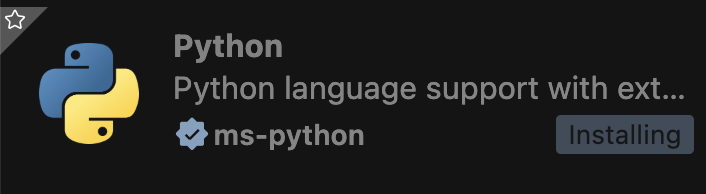
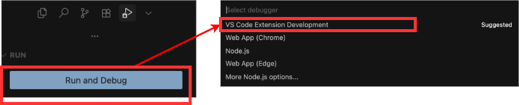
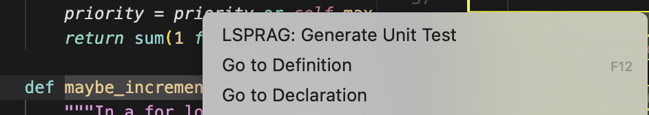
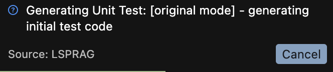

# Quick Start Guide with Source Code

Welcome! This guide will get you up and running with LSPRAG in minutes.

## 🚀 5-Minute Setup

### 0. Clone the Repo

```bash
git clone https://github.com/THU-WingTecher/LSPRAG.git
cd LSPRAG
```

### 1. Install Dependencies

If npm is not installed, install it first.

```bash
npm install --force
npm run compile
```

### 2. Install Language Server Extensions

**For Python:**
- Install "Pylance" and "Python" extensions


**For Java:**
- Install "Oracle Java Extension Pack" from VS Code Marketplace

**For Go:**
- Install "Go" extension
- Enable semantic tokens in settings:
```json
{
  "gopls": {
    "ui.semanticTokens": true
  }
}
```

### 3. Download Baseline Project

```bash
cd experiments
mkdir projects
cd projects
git clone https://github.com/psf/black.git
```

### 4. Activate Extension

- Navigate to `src/extension.ts`
- Click "Run and Debug" and select "VS Code Extension Development"

- A new VS Code editor will open - use this for subsequent actions

### 5. Configure LLM Settings

**Critical**: Configure LLM settings in the newly opened VS Code editor (not the original one).

**Option A: VS Code Settings UI**
- Open Settings (`Ctrl/Cmd + ,`)
- Search for "LSPRAG"
- Configure provider, model, and API keys

**Option B: Direct JSON Configuration**
Add to `settings.json`:
```json
{
  "LSPRAG": {
    "provider": "deepseek",
    "model": "deepseek-chat",
    "deepseekApiKey": "your-api-key",
    "openaiApiKey": "your-openai-key",
    "localLLMUrl": "http://localhost:11434",
    "savePath": "lsprag-tests",
    "promptType": "detailed",
    "generationType": "original",
    "maxRound": 3
  }
}
```

**Option C: Environment Variables** (for tests)
```bash
export DEEPSEEK_API_KEY="your-key"
export OPENAI_API_KEY="your-key"
export LOCAL_LLM_URL="http://localhost:11434"
```

Verify configuration: `Ctrl+Shift+P` → `LSPRAG: Show Current Settings`

### 6. Generate Tests

1. **Open Your Project**
   - Open workspace in the new VS Code editor
   - Navigate to: `LSPRAG/experiments/projects/black`
   - Ensure language servers are active

2. **Generate Unit Test**
   - Navigate to any function or method
   - Right-click within the function definition
   - Select **"LSPRAG: Generate Unit Test"** from the context menu
   
   - Wait for generation to complete
   


## 📚 Learning Path

### Step 1: Explore Test Files (Recommended Starting Point)

The best way to learn LSPRAG is through our test files. They serve as both documentation and examples.

**AST Tests** - Learn how we parse code:
```bash
# View the test file
code src/test/suite/ast/ast.test.ts

# Run it
npm run test --testfile=ast.ast
```

**LSP Tests** - Learn how we use Language Server Protocol:
```bash
# View the test file
code src/test/suite/lsp/python.test.ts

# Run it
npm run test --testfile=lsp.python
```

### Step 2: Modify a Test

Open `src/test/suite/lsp/symbol.test.ts` and try:

1. **Add a new assertion**:
```typescript
test('Python - Symbol Finding All Test', async function() {
    // ... existing code ...
    
    // Add this line
    const mySymbol = symbols.find(s => s.name === 'your_function_name');
    assert.ok(mySymbol, 'Should find your_function_name');
});
```

2. **Run your modified test**:
```bash
npm run test --testfile=lsp.symbol
```

3. **Debug if needed**: Set breakpoints and use VS Code debugger

### Step 3: Create Your Own Test

Copy an existing test and modify it:

```typescript
// In src/test/suite/lsp/my-test.test.ts
import * as assert from 'assert';
import * as vscode from 'vscode';
import * as path from 'path';
import { getAllSymbols } from '../../../lsp/symbol';
import { getConfigInstance } from '../../../config';
import { setWorkspaceFolders } from '../../../helper';

suite('My First Test', () => {
    test('My Test Case', async function() {
        const fixturesDir = path.join(__dirname, '../../../../src/test/fixtures');
        const pythonProjectPath = path.join(fixturesDir, 'python');
        
        getConfigInstance().updateConfig({
            workspace: pythonProjectPath
        });
        
        const workspaceFolders = setWorkspaceFolders(pythonProjectPath);
        const fileUri = vscode.Uri.file(path.join(pythonProjectPath, 'calculator.py'));
        const symbols = await getAllSymbols(fileUri);
        
        assert.ok(symbols.length > 0, 'Should find symbols');
    });
});
```

Run it:
```bash
npm run test --testfile=lsp.my-test
```

## 🎯 Test Suites Overview

### `suite/ast/` - Abstract Syntax Tree Tests

Learn how we parse code structure:

- **`ast.test.ts`** - Basic parsing for all languages
- **`py.cfg.test.ts`** - Python control flow graphs
- **`java.cfg.test.ts`** - Java control flow graphs
- **`go.cfg.test.ts`** - Go control flow graphs

**Try this**:
```bash
npm run test --testfile=ast.py.cfg
```

### `suite/lsp/` - Language Server Protocol Tests

Learn how we use LSP for semantic analysis:

- **`symbol.test.ts`** - Find functions, classes, methods
- **`token.test.ts`** - Extract tokens from code
- **`python.test.ts`** - Complete Python workflow
- **`context.test.ts`** - Collect code context

**Try this**:
```bash
npm run test --testfile=lsp.python
```

### `suite/llm/` - LLM Integration Tests

Learn how we interact with language models (to be expanded):

- Create your own tests here to experiment with LLM integration

## 🔧 Common Commands

```bash
# Compile TypeScript
npm run compile

# Run all tests
npm run test

# Run specific test
npm run test --testfile=lsp.symbol

# Run multiple tests
npm run test --testfile=ast,lsp.symbol

# Lint code
npm run lint
```

## 📖 Key Files to Read

1. **`src/test/suite/lsp/Readme.md`** - Detailed LSP test guide
2. **`src/test/suite/lsp/python.test.ts`** - Complete example workflow
3. **`src/lsp/symbol.ts`** - How symbol discovery works
4. **`src/generate.ts`** - Main generation logic

## ⚙️ Environment Setup (Optional)

For tests that use LLMs, see **Option C** in step 5 above.

## 🎓 Next Steps

1. ✅ Run `ast.ast` test
2. ✅ Run `lsp.python` test
3. ✅ Modify a test and see what happens
4. ✅ Read `CONTRIBUTING.md` for detailed guide
5. ✅ Pick a feature to work on

## 💡 Tips

- **Start small**: Modify existing tests before creating new ones
- **Read the code**: Tests are well-commented and educational
- **Use fixtures**: Test data is in `src/test/fixtures/`
- **Ask questions**: Open an issue if you're stuck

## 🚨 Troubleshooting

**Tests fail?**
- Make sure language servers are installed (Python, Java, Go extensions)
- For Go: `go install golang.org/x/tools/gopls@latest`
- Wait longer for language servers to initialize

**Compilation errors?**
- Run `npm run compile`
- Check TypeScript version: `npm list typescript`

**Extension not working?**
- Check VS Code version (1.95.0+)
- Check Node.js version (20+)
- Check Developer Console for errors

---

**Ready to contribute?** Check out [CONTRIBUTING.md](./CONTRIBUTING.md) for the full guide!

