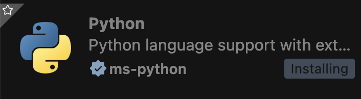
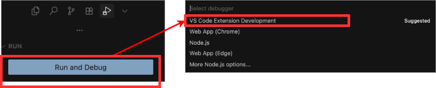

# LSPRAG - Language-Agnostic Real-Time Unit Test Generation

**This project is active. If you encounter any errors or have suggestions, feel free to open an issue!**

<div align="center">

<!--  -->

**VS Code Extension for AI-Powered Unit Test Generation**

[](https://code.visualstudio.com/)
[](LICENSE)
[](https://www.typescriptlang.org/)
[](https://nodejs.org/)

</div>

## Overview

LSPRAG (Language Server Protocol-based AI Generation) is a cutting-edge VS Code extension that leverages Language Server Protocol (LSP) integration and Large Language Models (LLMs) to automatically generate high-quality unit tests in real-time. By combining semantic code analysis with AI-powered generation, LSPRAG delivers contextually accurate and comprehensive test suites across multiple programming languages.

## ✨ Key Features

### 🚀 **Real-Time Generation**
- Generate unit tests instantly as you code
- Context-aware test creation based on function semantics
- Intelligent test case generation with edge case coverage

### 🌍 **Multi-Language Support**
- **Java**: Full support with JUnit framework
- **Python**: Comprehensive pytest integration
- **Go**: Native Go testing framework support
- **Extensible**: Easy to add support for additional languages

### 🎯 **Advanced Capabilities**
- **Semantic Analysis**: Deep code understanding through LSP
- **Dependency Resolution**: Automatic import and mock generation
- **Coverage Optimization**: Generate tests for maximum code coverage
- **Multiple LLM Providers**: Support for OpenAI, DeepSeek, and Ollama
- **Customizable Prompts**: Multiple generation strategies available

## 📖 Getting Started & Contributing

New to LSPRAG? Want to contribute? We've got you covered!

- **[Quick Start Guide](./QUICKSTART.md)** - Get up and running in 5 minutes. Perfect for first-time contributors!
- **[Contributing Guide](./CONTRIBUTING.md)** - Comprehensive guide explaining the codebase, architecture, and how to contribute

**Recommended path for new contributors:**
1. Start with [Quick Start Guide](./QUICKSTART.md) to run your first test
2. Explore test files in `src/test/suite/` (ast, lsp, llm)
3. Modify and experiment with existing tests
4. Read [Contributing Guide](./CONTRIBUTING.md) for deep dive into architecture

## 🎯 Project Status

| Language | Status | Framework | Features |
|----------|--------|-----------|----------|
| **Java** | ✅ Production Ready | JUnit 4/5 | Full semantic analysis, mock generation |
| **Python** | ✅ Production Ready | pytest | Type hints, async support, fixtures |
| **Go** | ✅ Production Ready | Go testing | Package management, benchmarks |

## 🛠️ Installation & Setup

### Prerequisites

- **VS Code**: Version 1.95.0 or higher
- **Node.js**: Version 20 or higher

### Installation Steps
**Note**: Currently, LSPRAG is available only as source code. While we plan to publish it as a one-click extension in the future, we're maintaining source-only distribution to preserve anonymity. Please follow the steps below to set up the application.


1. **Download Source Code**
   - Use `git clone` or download the ZIP file directly

2. **Setup Project**
   - Navigate to the project's root directory `LSPRAG`
   - Install dependencies: `npm install --force`
   - Compile the project: `npm run compile`

3. **Install Language Server Extensions**
   
   **For Python:**
   - Install "Pylance" and "Python" extensions
   
   
   **For Java:**
   - Install "Oracle Java Extension Pack" from VS Code Marketplace
   
   **For Go:**
   - Install "Go" extension
   - Enable semantic tokens in settings:
   ```json
   {
     "gopls": {
       "ui.semanticTokens": true
     }
   }
   ```

4. **Download Baseline Python Project**
   - Navigate to experiments directory: `cd experiments`
   - Create projects folder: `mkdir projects`
   - Clone a sample project: `git clone https://github.com/psf/black.git`

5. **Activate Extension**
   - Navigate to `src/extension.ts`
   - Click "Run and Debug" and select "VS Code Extension Development"
   
   - A new VS Code editor will open - use this for subsequent actions
6. **⚠️ IMPORTANT: Configure LLM Settings in the NEW Editor**
   
   **Critical**: You must configure your LLM settings in the newly opened VS Code editor (not the original one) for LSPRAG to work properly.
   
   
   **Option A: VS Code Settings UI**
   - Open VS Code Settings (`Ctrl/Cmd + ,`)
   - Search for "LSPRAG" settings
   - Configure provider, model, and API keys
   
   **Option B: Direct JSON Configuration**
   Add to your `settings.json`:
   ```json
   {
     "LSPRAG": {
       "provider": "deepseek",
       "model": "deepseek-chat",
       "deepseekApiKey": "your-api-key",
       "openaiApiKey": "your-openai-key",
       "localLLMUrl": "http://localhost:11434",
       "savePath": "lsprag-tests",
       "promptType": "detailed",
       "generationType": "original",
       "maxRound": 3
     }
   }
   ```

   Test your configuration with `Ctrl+Shift+P` → `LSPRAG: Show Current Settings`

## 🚀 Usage

### Basic Workflow

1. **Open Your Project**
   - Open your workspace in the new VS Code editor
   - Navigate to the black project: `LSPRAG/experiments/projects/black`
   - Ensure language servers are active for your target language

2. **Generate Tests**
   - Navigate to any function or method
   - Right-click within the function definition
   - Select **"LSPRAG: Generate Unit Test"** from the context menu
   
   - Wait for generation to complete
   

3. **Review & Deploy**
   - Generated tests will appear with accept/reject options
   

### Command Palette Commands

- `LSPRAG: Generate Unit Test` - Generate tests for selected function
- `LSPRAG: Show Current Settings` - Display current configuration
- `LSPRAG: Test LLM` - Test LLM connectivity and configuration

## ⚙️ Configuration

### Core Settings

| Setting | Type | Default | Description |
|---------|------|---------|-------------|
| `LSPRAG.provider` | string | `"deepseek"` | LLM provider (deepseek, openai, ollama) |
| `LSPRAG.model` | string | `"deepseek-chat"` | Model name for generation |
| `LSPRAG.savePath` | string | `"lsprag-tests"` | Output directory for generated tests |
| `LSPRAG.promptType` | string | `"basic"` | Prompt strategy for generation |
| `LSPRAG.generationType` | string | `"original"` | Generation approach |
| `LSPRAG.maxRound` | number | `3` | Maximum refinement rounds |

### API Configuration

#### DeepSeek
```json
{
  "LSPRAG.provider": "deepseek",
  "LSPRAG.model": "deepseek-chat",
  "LSPRAG.deepseekApiKey": "your-api-key"
}
```

#### OpenAI
```json
{
  "LSPRAG.provider": "openai",
  "LSPRAG.model": "gpt-4o-mini",
  "LSPRAG.openaiApiKey": "your-api-key"
}
```

#### Ollama (Local)
```json
{
  "LSPRAG.provider": "ollama",
  "LSPRAG.model": "llama3-70b",
  "LSPRAG.localLLMUrl": "http://localhost:11434"
}
```

### Advanced Features

#### Generation Strategies

- **`naive`**: Basic test generation without semantic analysis
- **`original`**: Standard LSP-aware generation (recommended)
- **`agent`**: Multi-step reasoning with iterative refinement
- **`cfg`**: Control flow graph-based generation
- **`experimental`**: Latest experimental features
- **`fastest`**: Optimized for speed
- **`best`**: Highest quality generation

#### Prompt Types

- **`basic`**: Minimal context, fast generation
- **`detailed`**: Comprehensive context analysis
- **`concise`**: Balanced approach
- **`fastest`**: Speed-optimized prompts
- **`best`**: Quality-optimized prompts

## 💻 System Requirements

### Hardware Requirements

- **Minimum**: 8GB RAM, 4 CPU cores
- **Recommended**: 16GB RAM, 8 CPU cores
- **GPU**: Optional but recommended for local LLM inference

---
**Ready to generate unit tests with LSPRAG!** 🎉

