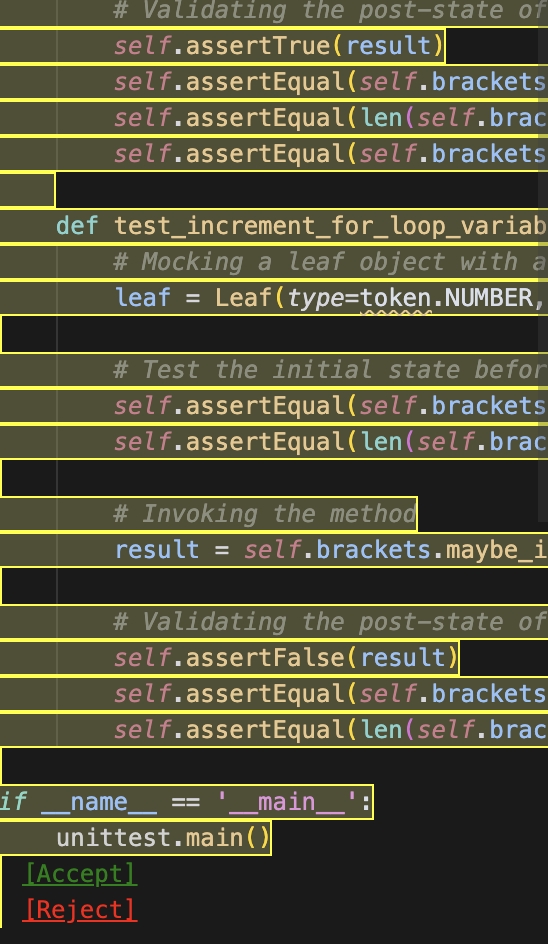

# LSPRAG - Language-Agnostic Real-Time Unit Test Generation

**This project is active. If you encounter any errors or have suggestions, feel free to open an issue!**

<div align="center">

<!--  -->

**VS Code Extension for AI-Powered Unit Test Generation**

[](https://code.visualstudio.com/)
[](LICENSE)
[](https://www.typescriptlang.org/)
[](https://nodejs.org/)

</div>

## Overview

LSPRAG (Language Server Protocol-based AI Generation) is a cutting-edge VS Code extension that leverages Language Server Protocol (LSP) integration and Large Language Models (LLMs) to automatically generate high-quality unit tests in real-time. By combining semantic code analysis with AI-powered generation, LSPRAG delivers contextually accurate and comprehensive test suites across multiple programming languages.

## ✨ Key Features

### 🚀 **Real-Time Generation**
- Generate unit tests instantly as you code
- Context-aware test creation based on function semantics
- Intelligent test case generation with edge case coverage

### 🌍 **Multi-Language Support**
- **Java**: Full support with JUnit framework
- **Python**: Comprehensive pytest integration
- **Go**: Native Go testing framework support
- **Extensible**: Easy to add support for additional languages

## 🛠️ Installation & Setup

1. Download the extension named `LSPRAG` 

2. Setup LLM in vscode settings

**Option A: VS Code Settings UI**
- Open Settings (`Ctrl/Cmd + ,`)
- Search for "LSPRAG"
- Configure provider, model, and API keys
- for example, you can set provider as deepseek, and model as deepseek-chat, and you can also set provider as openai and model as gpt-4o-mini, or gpt-5.

**Option B: Direct JSON Configuration**
Add to `settings.json`:
```json
{
  "LSPRAG": {
    "provider": "deepseek",
    "model": "deepseek-chat",
    "deepseekApiKey": "your-api-key",
    "openaiApiKey": "your-openai-key",
    "localLLMUrl": "http://localhost:11434",
    "savePath": "lsprag-tests",
    "promptType": "detailed",
    "generationType": "original",
    "maxRound": 3
  }
}
```

3. You are ready!

### Basic Workflow

1. **Open Your Project**
   - Open your workspace in the new VS Code editor
   - Or you can directly clone our project and move to its demo files
   - `git clone https://github.com/THU-WingTecher/LSPRAG.git`
   - Navigate to the demo test files: `LSPRAG/src/test/fixtures/python`
   - At Editor, click left-up `File` -> `Open Folder` -> Select workspace to `LSPRAG/src/test/fixtures/python`
   - [Optional] Test core utilities
      - You can check out your current setting by calling `Cmd/Cntrl + Shift + P => LSPRAG: Show Current Settings`
      - You can test your LLM avaialbility by calling `Cmd/Cntrl + Shift + P => LSPRAG: Test LLM`
      - You can test your Language Server avaialbility by calling `Cmd/Cntrl + Shift + P => LSPRAG: Test Language Server`

2. **Generate Tests**
   - Navigate to any function or method
   - Right-click within the function definition
   - Select **"LSPRAG: Generate Unit Test"** from the context menu
   
   - Wait for generation to complete
   

3. **Review & Deploy**
   - Generated tests will appear with accept/reject options
   

4. **Final Result** 
   - All logs including LLM prompt and specific cfg, and diagnositc-fix histories will be saved under `{your-workspace}/lsprag-workspace/`
   - If you click [Accept] the test file, the test file will be saved at `{your-workspace}/lsprag-tests`
   - You can change the save path by chaning default value of save path. You can change it through VS Code Extension settings at the same interface with set up LLM.

### Command Palette Commands

- `LSPRAG: Generate Unit Test` - Generate tests for selected function
- `LSPRAG: Show Current Settings` - Display current configuration
- `LSPRAG: Test LLM` - Test LLM connectivity and configuration

## 📖 Getting Started & Contributing

New to LSPRAG? Want to contribute? We've got you covered!

- **[Quick Start Guide](./QUICKSTART.md)** - Get up and running in 5 minutes. Perfect for first-time contributors!
- **[Contributing Guide](./CONTRIBUTING.md)** - Comprehensive guide explaining the codebase, architecture, and how to contribute

**Recommended path for new contributors:**
1. Start with [Quick Start Guide](./QUICKSTART.md) to run your first test
2. Explore test files in `src/test/suite/` (ast, lsp, llm)
3. Modify and experiment with existing tests
4. Read [Contributing Guide](./CONTRIBUTING.md) for deep dive into architecture

## 🎯 Project Status

| Language | Status | Framework | Features |
|----------|--------|-----------|----------|
| **Java** | ✅ Production Ready | JUnit 4/5 | Full semantic analysis, mock generation |
| **Python** | ✅ Production Ready | pytest | Type hints, async support, fixtures |
| **Go** | ✅ Production Ready | Go testing | Package management, benchmarks |


## ⚙️ Configuration

### Core Settings

| Setting | Type | Default | Description |
|---------|------|---------|-------------|
| `LSPRAG.provider` | string | `"deepseek"` | LLM provider (deepseek, openai, ollama) |
| `LSPRAG.model` | string | `"deepseek-chat"` | Model name for generation |
| `LSPRAG.savePath` | string | `"lsprag-tests"` | Output directory for generated tests |
| `LSPRAG.promptType` | string | `"basic"` | Prompt strategy for generation |
| `LSPRAG.generationType` | string | `"original"` | Generation approach |
| `LSPRAG.maxRound` | number | `3` | Maximum refinement rounds |

### API Configuration

#### DeepSeek
```json
{
  "LSPRAG.provider": "deepseek",
  "LSPRAG.model": "deepseek-chat",
  "LSPRAG.deepseekApiKey": "your-api-key"
}
```

#### OpenAI
```json
{
  "LSPRAG.provider": "openai",
  "LSPRAG.model": "gpt-4o-mini",
  "LSPRAG.openaiApiKey": "your-api-key"
}
```

#### Ollama (Local)
```json
{
  "LSPRAG.provider": "ollama",
  "LSPRAG.model": "llama3-70b",
  "LSPRAG.localLLMUrl": "http://localhost:11434"
}
```

---
**Ready to generate unit tests with LSPRAG!** 🎉

