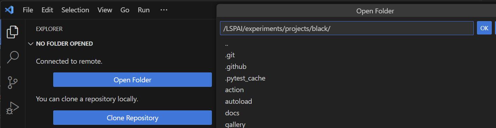
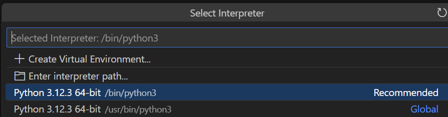
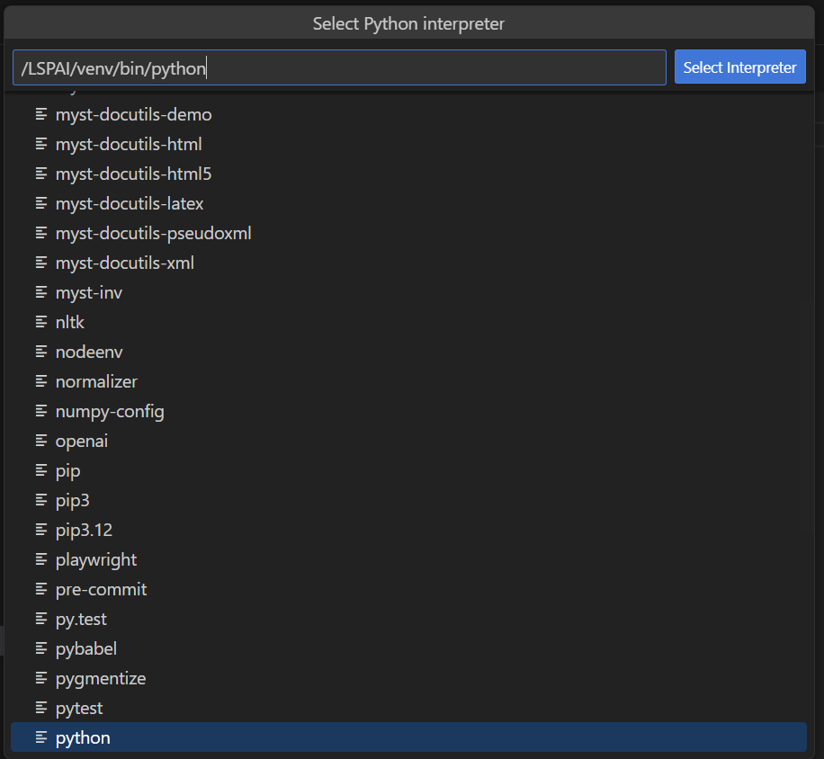
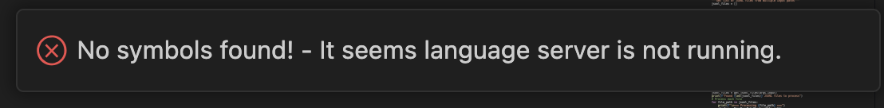
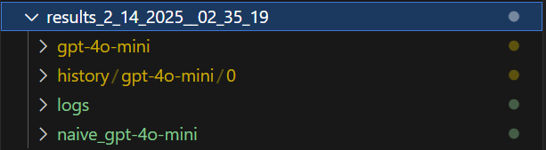

# LSPAI Experiment Reproduction Guide
<p align="center">
    <!-- <a href="https://arxiv.org/abs/2302.02261"> -->
    <!-- <a href="https://doi.org/10.5281/zenodo.12669927"> -->
    <a href="https://github.com/THU-WingTecher/DeepConstr/blob/main/LICENSE"></a>
    <a href="https://hub.docker.com/repository/docker/gwihwan/lspai/general"></a>
</p>

## Table of Contents
- [LSPAI Experiment Reproduction Guide](#lspai-experiment-reproduction-guide)
  - [Table of Contents](#table-of-contents)
  - [🛠️ Setup Guide](#️-setup-guide)
    - [1. Install LSPAI Extension](#1-install-lspai-extension)
      - [Option A: VS Code Marketplace (Coming Soon!)](#option-a-vs-code-marketplace-coming-soon)
      - [Option B: Build from Source](#option-b-build-from-source)
  - [Reproduce Experiment Results](#reproduce-experiment-results)
    - [Prepare Unit Test Codes](#prepare-unit-test-codes)
      - [Option A: Generate Unit Tests (Manual Method)](#option-a-generate-unit-tests-manual-method)
      - [Option B: Use Pre-generated Dataset (Recommended)](#option-b-use-pre-generated-dataset-recommended)
    - [Python Projects \[ BLACK, CRAWL4AI\]](#python-projects--black-crawl4ai)
      - [Prepare Unit Test Codes](#prepare-unit-test-codes-1)
      - [Black Project Setup](#black-project-setup)
        - [Reproduce Experiment for Black Project](#reproduce-experiment-for-black-project)
        - [Analysis of Results](#analysis-of-results)
      - [Crawl4ai Project Setup](#crawl4ai-project-setup)
        - [Reproduce Experiment for CRAWL4AI Project](#reproduce-experiment-for-crawl4ai-project)
        - [Analysis of Results](#analysis-of-results-1)
    - [Go Projects \[LOGRUS, COBRA\]](#go-projects-logrus-cobra)
      - [Prepare Unit Test Codes](#prepare-unit-test-codes-2)
      - [Logrus Project Setup](#logrus-project-setup)
        - [Coverage Analysis](#coverage-analysis)
        - [Valid Rate Analysis](#valid-rate-analysis)
      - [Cobra Project Setup](#cobra-project-setup)
        - [Coverage Analysis](#coverage-analysis-1)
        - [Valid Rate Analysis](#valid-rate-analysis-1)
    - [Java Projects \[Commons-Cli, Commons-Csv\]](#java-projects-commons-cli-commons-csv)
      - [Java Setup](#java-setup)
      - [Commons-Cli Project Setup](#commons-cli-project-setup)
        - [\[OPTIONAL\] A. Reproduce by Generating New Test Codes](#optional-a-reproduce-by-generating-new-test-codes)
        - [B. Reproduce with Provided Dataset](#b-reproduce-with-provided-dataset)
        - [Reproduce Experiment Results :: Coverage](#reproduce-experiment-results--coverage)
        - [Coverage Analysis](#coverage-analysis-2)
        - [Reproduce Experiment Results :: Valid Rate](#reproduce-experiment-results--valid-rate)
        - [Valid Rate Analysis](#valid-rate-analysis-2)
      - [Commons-Csv Project Setup](#commons-csv-project-setup)
        - [\[OPTIONAL\] A. Reproduce by Generating New Test Codes](#optional-a-reproduce-by-generating-new-test-codes-1)
        - [B. Reproduce with Provided Dataset](#b-reproduce-with-provided-dataset-1)
        - [Reproduce Experiment Results :: Coverage](#reproduce-experiment-results--coverage-1)
        - [Coverage Analysis](#coverage-analysis-3)
        - [Reproduce Experiment Results :: Valid Rate](#reproduce-experiment-results--valid-rate-1)
        - [Valid Rate Analysis](#valid-rate-analysis-3)
    - [Throuput Experiment](#throuput-experiment)
      - [Reproduce Result](#reproduce-result)
      - [Interpret Result](#interpret-result)
  - [Conclusion](#conclusion)
    - [Prerequisites](#prerequisites)
    - [Prerequisites](#prerequisites-1)

## 🛠️ Setup Guide

### 1. Install LSPAI from Source

1. Pull the image and run
   ```bash
   docker pull gwihwan/lspai:latest
   docker run -it --name lspai gwihwan/lspai:latest /bin/bash
   ```

2. Clone and Build
   ```bash
   # Clone the repository
   cd ..
   git clone https://github.com/Gwihwan-Go/LSPAI.git
   cd LSPAI
   # Install dependencies
   npm install

   # Build the extension
   npm run compile
   ```

After installing the extension, please configure your language servers and LLM settings by following the 🛠️ Setup Guide in the [README](../README.md).

3. Known Issues : if you met the below error while compiling
```bash
node_modules/lru-cache/dist/commonjs/index.d.ts:1032:5 - error TS2416: Property 'forEach' in type 'LRUCache<K, V, FC>' is not assignable to the same property in base type 'Map<K, V>'.node_modules/lru-cache/dist/commonjs/index.d.ts:1032:5 - error TS2416: Property 'forEach' in type 'LRUCache<K, V, FC>' is not assignable to the same property in base type 'Map<K, V>'.
```
You can try to downgrade the version of lru-cache to 10.1.0 by running the following command:
```bash
npm install lru-cache@10.1.0
```

## Generate Unit Test Codes by LSPAI

### Language Server Installation

1. Download the Language Server of your target language (If you pull the docker image, these are already installed.)
   - Java: Oracle Java Extension Pack ( identifier : oracle.oracle-java)
   - Python: Pylance and Python extension ( identifier : ms-python.vscode-pylance, ms-python.python)
   - Go: Go extension ( identifier : golang.go)

2. Language-Specific Setup (This need to be setup)
   
   **For Go:**
   Enable semantic tokenization in your VS Code settings.json:
   ```json
   {
     "gopls": {
       "ui.semanticTokens": true
     }
   }
   ```

### Option A: Download IDE Plugin 

1. Download the IDE plugin from the [VS Code Marketplace](https://marketplace.visualstudio.com/items?itemName=LSPAI.lspai)
2. Install the plugin
3. SetUp LLM Configuration
   - Open the settings.json file
   - Add the following configuration:
   ```json
   {
     "lspAi": {
       "provider": "deepseek",    // Choose: // openai // deepseek // ollama
       "model": "deepseek-chat",  // Choose: // gpt-4o-mini // llama3-70b // deepseek-chat
       "openaiApiKey": "your-api-key",    // Required for OpenAI
       "deepseekApiKey": "your-api-key",  // Required for Deepseek
       "localLLMUrl": "http://your-ollama-server:port",  // Required for Ollama
       "proxyUrl": "your-proxy-server"    // Optional: Configure if using a proxy
     }
   }
   ```
4. Open the target project
5. [Optional] Project Compilation
   - While not required, compiling your project can improve error diagnosis and auto-fixing capabilities
5. Move cursor to the function you want to generate unit test codes
6. Press right-click and select `LSPAI: Generate Unit Test Codes`
7. Wait for the unit test codes to be generated

### Option B: Build from Source
Each programming language has slightly different steps. 
Overall, you can follow these steps:

If you followed the **Setup Guide :: Option A**, you can directly proceed with step 4.

1. Complete the LSPAI Extension installation (see Setup Guide above)
2. Launch LSPAI in Development Mode:
   - Open `/LSPAI/src/extension.ts`
   - Press `F5` to launch Extension Development Host
   - Select "VS Code Extension Development" from the dropdown
   - A new VS Code window should open

3. Configure the workspace:
   - Open the target project: Navigate to `experiments/project/black` 
   (File -> Open Folder -> select experiments/project/black)
   

   - **[Python-Specific]** Select Python interpreter: In the bottom-right section, choose your venv-python path.
   
   

Known Issue: If you met the below error, this happens when the language server is not installed.
   
Please install the language server and try again.

## Reproduce Experiment Results (Table 3)

Table 3 claims that LSPAI outperforms other baselines in terms of coverage, and part of valid rate compared to baselines.
There are two ways to proceed with the experiments:

### Prepare Unit Test Codes 

#### Option A: Generate Unit Tests (Manual Method)

> Note: Generating unit tests for every function in real-world projects is time-consuming. We provide pre-generated experiment data as an alternative (see Option B).

1. Checkout the branch
   ```bash
   git checkout fse-industry
   ```
2. Recompile the project
   ```bash
   cd /LSPAI
   npm install 
   npm run compile
   ```
3. Launch LSPAI in Development Mode:
   - Open `/LSPAI/src/extension.ts`
   - Press `F5` to launch Extension Development Host
   - Select "VS Code Extension Development" from the dropdown
   - A new VS Code window should open

4. Run the experiment:
   - Press `CTRL+SHIFT+P`
   - For Python, you should first generate venv-python version, and install necessary libraries, and select python interpreter at righ-bottom section of vscode.
   - Run one of folloing commands: `LSPAI::Python-Experiment`; `LSPAI::Java-Experiment`; `LSPAI::Go-Experiment`;  
   - Monitor progress in the debug console
   - After the experiment ended, you can find out the result_${current_time} folder at your workspace.
   

#### Option B: Use Pre-generated Dataset (Recommended)

Download and extract the experiment dataset:
```bash
cd /LSPAI
mkdir -p experiments 
mkdir experiments/data
wget --no-check-certificate "https://cloud.tsinghua.edu.cn/f/6035c7f930444f44917e/?dl=1" -O experiments/experimentData.tar.gz
cd experiments
tar xvfz experimentData.tar.gz
```

The extracted dataset will have this structure:
```
/LSPAI/experiments
├── experimentData.tar.gz
└── data
    ├── black
    ├── cobra
    ├── commons-cli
    ├── commons-csv
    └── logrus
```

### Java Projects [Commons-Cli, Commons-Csv]

   #### Java Setup
<!-- 
   Ensure that you download the necessary libraries from the provided link:
   ```bash
   cd /LSPAI/experiments/scripts
   mvn install
   ``` -->

   Ensure that you download the necessary libraries from the provided link:
   ```bash
   # Download required libraries
   cd /LSPAI/experiments/scripts
   wget --no-check-certificate "https://cloud.tsinghua.edu.cn/f/efade5fc56a54ee59ed1/?dl=1" -O ../javaLib.tar.gz
   tar xvf ../javaLib.tar.gz
   ```

   After running above commands, you can observe that jar files are located at `/LSPAI/experiments/lib/`.
   ```bash
   |-- lib`
   |   |-- jacocoagent.jar
   |   |-- jacococli.jar
   |   |-- junit-jupiter-api-5.11.2.jar
   |   |-- junit-jupiter-engine-5.11.2.jar
   |   |-- junit-platform-console-standalone-1.8.2.jar
   |   `-- junit-platform-launcher-1.8.2.jar
```

   #### Commons-Cli Project Setup

   To set up the CLI project, follow these steps:
   ```bash
   # Clone and checkout a specific version
   mkdir -p /LSPAI/experiments/projects
   cd /LSPAI/experiments/projects
   git clone https://github.com/apache/commons-cli.git
   cd commons-cli

   # Java Setup - This step is required for coverage analysis
   mvn install -DskipTests -Drat.skip=true
   mvn dependency:copy-dependencies
   ```

   ##### [OPTIONAL] A. Reproduce by Generating New Test Codes

   Next, open your development environment, configure settings, and ensure the correct setup by following the steps below:
   ```bash
   # Run development mode
   F5 -> Run

   # Open the project
   Open project directory

   # Choose model at settings.json
   Ensure correct model selection in the configuration file (settings.json)

   # Trigger Java Experiment Mode
   Ctrl + Shift + P -> LSPAI::Java-Experiment
   ```

   If you are reproducing the experiment, by commandline interface, not debuggin mode. 
   The java language server cannot automatically add the test file to class path, therefore you need to manually add test path in the pom.xml file. 
   For example, 
   // We should move file to the 
    // ${project.basedir}/src/lspai/test/java --> to get the correct and fast diagnostics
    // <plugin>
    //     <groupId>org.codehaus.mojo</groupId>
    //     <artifactId>build-helper-maven-plugin</artifactId>
    //     <version>3.5.0</version>
    //     <executions>
    //         <execution>
    //             <id>add-test-source</id>
    //             <phase>generate-test-sources</phase>
    //             <goals>
    //                 <goal>add-test-source</goal>
    //             </goals>
    //             <configuration>
    //                 <sources>
    //                     <!-- Add your additional test source directory -->
    //                     <source>${project.basedir}/src/test/java</source>
    //                     <source>${project.basedir}/src/lspai/test/java</source>
    //                 </sources>
    //             </configuration>
    //         </execution>
    //     </executions>
    // </plugin>

   ##### B. Reproduce with Provided Dataset ( Table 3 )

   Once the environment is set up and the unit tests are prepared, you can proceed to reproduce experiments using the provided dataset.

   ##### Reproduce Experiment Results :: Coverage

   Run the following commands one at a time, and checkout results. 
   You have to run six different commands for each baseline (NAIVE, LSPAI) and each model (DeepSeek, GPT4o, etc.):

   ```bash
   # LSPAI - DS-V3
   bash /LSPAI/experiments/scripts/java_coverage.bash \
      /LSPAI/experiments/projects/commons-cli \
      /LSPAI/experiments/data/commons-cli/results_deepseek/deepseek-chat

   # NAIVE - DS-V3
   bash /LSPAI/experiments/scripts/java_coverage.bash \
      /LSPAI/experiments/projects/commons-cli \
      /LSPAI/experiments/data/commons-cli/results_deepseek/NOFIX_deepseek-chat

   # LSPAI - GPT4o
   bash /LSPAI/experiments/scripts/java_coverage.bash \
      /LSPAI/experiments/projects/commons-cli \
      /LSPAI/experiments/data/commons-cli/results_gpt-4o/gpt-4o

   # NAIVE - GPT4o
   bash /LSPAI/experiments/scripts/java_coverage.bash \
      /LSPAI/experiments/projects/commons-cli \
      /LSPAI/experiments/data/commons-cli/results_gpt-4o/naive_gpt-4o

   # LSPAI - GPT4o-mini
   bash /LSPAI/experiments/scripts/java_coverage.bash \
      /LSPAI/experiments/projects/commons-cli \
      /LSPAI/experiments/data/commons-cli/results_gpt-4o-mini/gpt-4o-mini

   # NAIVE - GPT4o-mini
   bash /LSPAI/experiments/scripts/java_coverage.bash \
      /LSPAI/experiments/projects/commons-cli \
      /LSPAI/experiments/data/commons-cli/results_gpt-4o-mini/naive_gpt-4o-mini
   ```

   ##### Coverage Analysis
   
   After running the above commands, you can view the coverage results by navigating to the generated report.

   **Example: JaCoCo Coverage Report (LSPAI, deepseek-V3):**
   ```
   # View report
   open /LSPAI/experiments/data/commons-cli/results_deepseek/deepseek-chat-report/index.html
   ```
   You can see the coverage report like below figure.
   
   Checkout **Missed** and **Lines** columns for line coverage.
   
   

   ##### Reproduce Experiment Results :: Valid Rate

   Run the following commands one at a time, and checkout results. 
   You have to run six different commands for each baseline (NAIVE, LSPAI) and each model (DeepSeek, GPT4o, etc.):

   ```bash
   # LSPAI - DS-V3
   bash /LSPAI/experiments/scripts/java_passrate.bash \
      /LSPAI/experiments/projects/commons-cli \
      /LSPAI/experiments/data/commons-cli/results_deepseek/deepseek-chat

   # NAIVE - DS-V3
   bash /LSPAI/experiments/scripts/java_passrate.bash \
      /LSPAI/experiments/projects/commons-cli \
      /LSPAI/experiments/data/commons-cli/results_deepseek/naive_deepseek-chat

   # LSPAI - GPT4o
   bash /LSPAI/experiments/scripts/java_passrate.bash \
      /LSPAI/experiments/projects/commons-cli \
      /LSPAI/experiments/data/commons-cli/results_gpt-4o/gpt-4o

   # NAIVE - GPT4o
   bash /LSPAI/experiments/scripts/java_passrate.bash \
      /LSPAI/experiments/projects/commons-cli \
      /LSPAI/experiments/data/commons-cli/results_gpt-4o/naive_gpt-4o

   # LSPAI - GPT4o-mini
   bash /LSPAI/experiments/scripts/java_passrate.bash \
      /LSPAI/experiments/projects/commons-cli \
      /LSPAI/experiments/data/commons-cli/results_gpt-4o-mini/gpt-4o-mini

   # NAIVE - GPT4o-mini
   bash /LSPAI/experiments/scripts/java_passrate.bash \
      /LSPAI/experiments/projects/commons-cli \
      /LSPAI/experiments/data/commons-cli/results_gpt-4o-mini/naive_gpt-4o-mini
   ```

   ##### Valid Rate Analysis
   
   After running the above commands, valid rate is printed as below (LSPAI, deepseek):
   ```
   Total .java files: 207
   Files with corresponding .class files: 119
   Pass rate: 57.49%
   ```

   #### Commons-Csv Project Setup

   To set up the CSV project, follow these steps:
   ```bash
   # Clone and checkout a specific version
   mkdir -p /LSPAI/experiments/projects
   cd /LSPAI/experiments/projects
   git clone https://github.com/apache/commons-csv.git
   cd commons-csv

   # Java Setup
   mvn install -DskipTests -Drat.skip=true
   mvn dependency:copy-dependencies
   ```

   ##### [OPTIONAL] A. Reproduce by Generating New Test Codes

   Next, open your development environment, configure settings, and ensure the correct setup by following the steps below:
   ```bash
   # Run development mode
   F5 -> Run

   # Open the project
   Open project directory

   # Choose model at settings.json
   Ensure correct model selection in the configuration file (settings.json)

   # Trigger Java Experiment Mode
   Ctrl + Shift + P -> LSPAI::Java-Experiment
   ```
   For more information, please refer the instruction of **Prepare Unit Test Codes :: Option A**

   ##### B. Reproduce with Provided Dataset

   Once the environment is set up and the unit tests are prepared, you can proceed to reproduce experiments using the provided dataset.

   <!-- **A. Download Compiled Files**

   Download the compiled files, which are necessary for JaCoCo coverage reports. These files must match the binaries used when generating unit tests:
   ```bash
   # Download required libraries
   cd /LSPAI/experiments
   wget --no-check-certificate "https://cloud.tsinghua.edu.cn/f/80c9bac1a6e14f7ab9da/?dl=1" -O csvClasses.tar.gz
   tar xvf csvClasses.tar.gz
   rm -r projects/commons-csv/target/classes
   mv classes projects/commons-csv/target
   ```

   After running above commands, you can observe that class files are located at `commons-csv/target/classes`.
   
   ```bash
   projects/commons-csv/target
   |-- antrun
   |   `-- build-main.xml
   |-- apidocs
   |   `-- META-INF
   |-- classes
   |   |-- META-INF
   |   `-- org
   ``` -->

   ##### Reproduce Experiment Results :: Coverage

   Run the following commands one at a time, and checkout results. 
   You have to run six different commands for each baseline (NAIVE, LSPAI) and each model (DeepSeek, GPT4o, etc.):

   ```bash
   # LSPAI - DS-V3
   bash /LSPAI/experiments/scripts/java_coverage.bash \
      /LSPAI/experiments/projects/commons-csv \
      /LSPAI/experiments/data/commons-csv/results_deepseek/deepseek-chat

   # NAIVE - DS-V3
   bash /LSPAI/experiments/scripts/java_coverage.bash \
      /LSPAI/experiments/projects/commons-csv \
      /LSPAI/experiments/data/commons-csv/results_deepseek/naive_deepseek-chat

   # LSPAI - GPT4o
   bash /LSPAI/experiments/scripts/java_coverage.bash \
      /LSPAI/experiments/projects/commons-csv \
      /LSPAI/experiments/data/commons-csv/results_gpt-4o/gpt-4o

   # NAIVE - GPT4o
   bash /LSPAI/experiments/scripts/java_coverage.bash \
      /LSPAI/experiments/projects/commons-csv \
      /LSPAI/experiments/data/commons-csv/results_gpt-4o/naive_gpt-4o

   # LSPAI - GPT4o-mini
   bash /LSPAI/experiments/scripts/java_coverage.bash \
      /LSPAI/experiments/projects/commons-csv \
      /LSPAI/experiments/data/commons-csv/results_gpt-4o-mini/gpt-4o-mini

   # NAIVE - GPT4o-mini
   bash /LSPAI/experiments/scripts/java_coverage.bash \
      /LSPAI/experiments/projects/commons-csv \
      /LSPAI/experiments/data/commons-csv/results_gpt-4o-mini/naive_gpt-4o-mini
   ```

   ##### Coverage Analysis
   
   After running the above commands, you can view the coverage results by navigating to the generated report.

   **Example: JaCoCo Coverage Report (LSPAI, deepseek-V3):**
   ```
   # View report
   open /LSPAI/experiments/data/commons-csv/results_deepseek/deepseek-chat-report/index.html
   ```
   You can see the coverage report like below figure.
   
   Checkout **Missed** and **Lines** columns for line coverage.
   
   

   ##### Reproduce Experiment Results :: Valid Rate

   Run the following commands one at a time, and checkout results. 
   You have to run six different commands for each baseline (NAIVE, LSPAI) and each model (DeepSeek, GPT4o, etc.):

   ```bash
   # LSPAI - DS-V3
   bash /LSPAI/experiments/scripts/java_passrate.bash \
      /LSPAI/experiments/projects/commons-csv \
      /LSPAI/experiments/data/commons-csv/results_deepseek/deepseek-chat

   # NAIVE - DS-V3
   bash /LSPAI/experiments/scripts/java_passrate.bash \
      /LSPAI/experiments/projects/commons-csv \
      /LSPAI/experiments/data/commons-csv/results_deepseek/naive_deepseek-chat

   # LSPAI - GPT4o
   bash /LSPAI/experiments/scripts/java_passrate.bash \
      /LSPAI/experiments/projects/commons-csv \
      /LSPAI/experiments/data/commons-csv/results_gpt-4o/gpt-4o

   # NAIVE - GPT4o
   bash /LSPAI/experiments/scripts/java_passrate.bash \
      /LSPAI/experiments/projects/commons-csv \
      /LSPAI/experiments/data/commons-csv/results_gpt-4o/naive_gpt-4o

   # LSPAI - GPT4o-mini
   bash /LSPAI/experiments/scripts/java_passrate.bash \
      /LSPAI/experiments/projects/commons-csv \
      /LSPAI/experiments/data/commons-csv/results_gpt-4o-mini/gpt-4o-mini

   # NAIVE - GPT4o-mini
   bash /LSPAI/experiments/scripts/java_passrate.bash \
      /LSPAI/experiments/projects/commons-csv \
      /LSPAI/experiments/data/commons-csv/results_gpt-4o-mini/naive_gpt-4o-mini
   ```

   ##### Valid Rate Analysis
   
   After running the above commands, valid rate is printed as below (LSPAI, deepseek):
   ```
   Total .java files: 207
   Files with corresponding .class files: 119
   Pass rate: 57.49%
   ```


### Go Projects [LOGRUS, COBRA]

   #### Prepare Unit Test Codes 

   Option A: Generate Unit Tests (Manual Method)
   
   Follow above instructions.

   Option B: Use Pre-generated Dataset (Recommended)

   Download dataset by following **Prepare Unit Test Codes :: Option B**.

   #### Logrus Project Setup

   To set up the Logrus project, follow these steps:
   ```bash
   # Clone and checkout a specific version
   mkdir -p /LSPAI/experiments/projects
   cd /LSPAI/experiments/projects
   git clone https://github.com/sirupsen/logrus.git
   cd logrus
   # Optional: Checkout specific commit (if applicable)
   # git checkout <specific_version>

   # Go Setup
   go env -w GOPROXY=https://goproxy.io,direct
   go mod tidy
   ```

   ##### Coverage Analysis

   Once the environment is set up, you can reproduce the experiments using the provided dataset. For Logrus, the following command can be used to perform coverage analysis:

   ```bash
   # LSPAI - DS-V3
   bash /LSPAI/experiments/scripts/go_coverage.bash \
      /LSPAI/experiments/projects/logrus \
      /LSPAI/experiments/data/logrus/results_deepseek/deepseek-chat

   # NAIVE - DS-V3
   bash /LSPAI/experiments/scripts/go_coverage.bash \
      /LSPAI/experiments/projects/logrus \
      /LSPAI/experiments/data/logrus/results_deepseek/naive_deepseek-chat

   # LSPAI - GPT4o
   bash /LSPAI/experiments/scripts/go_coverage.bash \
      /LSPAI/experiments/projects/logrus \
      /LSPAI/experiments/data/logrus/results_gpt-4o/gpt-4o

   # NAIVE - GPT4o
   bash /LSPAI/experiments/scripts/go_coverage.bash \
      /LSPAI/experiments/projects/logrus \
      /LSPAI/experiments/data/logrus/results_gpt-4o/naive_gpt-4o

   # LSPAI - GPT4o-mini
   bash /LSPAI/experiments/scripts/go_coverage.bash \
      /LSPAI/experiments/projects/logrus \
      /LSPAI/experiments/data/logrus/results_gpt-4o-mini/gpt-4o-mini

   # NAIVE - GPT4o-mini
   bash /LSPAI/experiments/scripts/go_coverage.bash \
      /LSPAI/experiments/projects/logrus \
      /LSPAI/experiments/data/logrus/results_gpt-4o-mini/naive_gpt-4o-mini
   ```

   After running the above command, you will get coverage results displayed in the terminal. Here's an example output:

   ```bash
   ...
   github.com/sirupsen/logrus/writer.go:96.2,96.16 1 1
   github.com/sirupsen/logrus/writer.go:100.45,102.2 1 0
   Total Statements: 588
   Covered Statements: 174
   Coverage Percentage: 29.59%
   ```
   The Coverage Percentage represents the final coverage value for the Logrus project. In this case, it is 29.59%.

   Note: Coverage numbers may vary depending on the environment and configuration, but you can expect that LSPAI typically shows a slightly higher coverage compared to the naive approach.
   pass rate analysis 

   ##### Valid Rate Analysis

   To get the pass rate for your test files, run the following command:

   ```bash
   # LSPAI - DS-V3
   bash /LSPAI/experiments/scripts/go_passrate.bash \
      /LSPAI/experiments/projects/logrus \
      /LSPAI/experiments/data/logrus/results_deepseek/deepseek-chat

   # NAIVE - DS-V3
   bash /LSPAI/experiments/scripts/go_passrate.bash \
      /LSPAI/experiments/projects/logrus \
      /LSPAI/experiments/data/logrus/results_deepseek/naive_deepseek-chat

   # LSPAI - GPT4o
   bash /LSPAI/experiments/scripts/go_passrate.bash \
      /LSPAI/experiments/projects/logrus \
      /LSPAI/experiments/data/logrus/results_gpt-4o/gpt-4o

   # NAIVE - GPT4o
   bash /LSPAI/experiments/scripts/go_passrate.bash \
      /LSPAI/experiments/projects/logrus \
      /LSPAI/experiments/data/logrus/results_gpt-4o/naive_gpt-4o

   # LSPAI - GPT4o-mini
   bash /LSPAI/experiments/scripts/go_passrate.bash \
      /LSPAI/experiments/projects/logrus \
      /LSPAI/experiments/data/logrus/results_gpt-4o-mini/gpt-4o-mini

   # NAIVE - GPT4o-mini
   bash /LSPAI/experiments/scripts/go_passrate.bash \
      /LSPAI/experiments/projects/logrus \
      /LSPAI/experiments/data/logrus/results_gpt-4o-mini/naive_gpt-4o-mini
   ```

   Example output:

   ```bash
   Total test files: 30
   Pass rate: 21.428571428571427
   ```
   The Pass rate indicates the percentage of test files that passed successfully. In this case, 21.43% of the test files passed.

   #### Cobra Project Setup

   To set up the Cobra project, follow these steps:
   ```bash
   # Clone and checkout a specific version
   mkdir -p /LSPAI/experiments/projects
   cd /LSPAI/experiments/projects
   git clone https://github.com/spf13/cobra.git
   cd cobra
   # Optional: Checkout specific commit (if applicable)
   # git checkout <specific_version>

   # Go Setup
   go env -w GOPROXY=https://goproxy.io,direct
   go mod tidy
   ```

   ##### Coverage Analysis

   Once the environment is set up, you can reproduce the experiments using the provided dataset. For Cobra, the following command can be used to perform coverage analysis:

   ```bash
   # LSPAI - DS-V3
   bash /LSPAI/experiments/scripts/go_coverage.bash \
      /LSPAI/experiments/projects/cobra \
      /LSPAI/experiments/data/cobra/results_deepseek/deepseek-chat

   # NAIVE - DS-V3
   bash /LSPAI/experiments/scripts/go_coverage.bash \
      /LSPAI/experiments/projects/cobra \
      /LSPAI/experiments/data/cobra/results_deepseek/naive_deepseek-chat

   # LSPAI - GPT4o
   bash /LSPAI/experiments/scripts/go_coverage.bash \
      /LSPAI/experiments/projects/cobra \
      /LSPAI/experiments/data/cobra/results_gpt-4o/gpt-4o

   # NAIVE - GPT4o
   bash /LSPAI/experiments/scripts/go_coverage.bash \
      /LSPAI/experiments/projects/cobra \
      /LSPAI/experiments/data/cobra/results_gpt-4o/naive_gpt-4o

   # LSPAI - GPT4o-mini
   bash /LSPAI/experiments/scripts/go_coverage.bash \
      /LSPAI/experiments/projects/cobra \
      /LSPAI/experiments/data/cobra/results_gpt-4o-mini/gpt-4o-mini

   # NAIVE - GPT4o-mini
   bash /LSPAI/experiments/scripts/go_coverage.bash \
      /LSPAI/experiments/projects/cobra \
      /LSPAI/experiments/data/cobra/results_gpt-4o-mini/naive_gpt-4o-mini
   ```

   After running the above command, you will get coverage results displayed in the terminal. Here's an example output:

   ```bash
   ...
   yaml_docs_GenYamlTreeCustom1_test.go:93: Expected error due to GenYamlCustom failure, got nil
   FAIL
   coverage: 22.2% of statements in github.com/spf13/cobra, github.com/spf13/cobra/doc
   FAIL    github.com/spf13/cobra/doc      0.008s
   ```
   The Coverage Percentage represents the final coverage value for the Logrus project. In this case, it is 22.2%.

   Note: Coverage numbers may vary depending on the environment and configuration, but you can expect that LSPAI typically shows a slightly higher coverage compared to the naive approach.
   pass rate analysis 

   ##### Valid Rate Analysis

   To get the pass rate for your test files, run the following command:

   ```bash
   # LSPAI - DS-V3
   bash /LSPAI/experiments/scripts/go_passrate.bash \
      /LSPAI/experiments/projects/cobra \
      /LSPAI/experiments/data/cobra/results_deepseek/deepseek-chat

   # NAIVE - DS-V3
   bash /LSPAI/experiments/scripts/go_passrate.bash \
      /LSPAI/experiments/projects/cobra \
      /LSPAI/experiments/data/cobra/results_deepseek/naive_deepseek-chat

   # LSPAI - GPT4o
   bash /LSPAI/experiments/scripts/go_passrate.bash \
      /LSPAI/experiments/projects/cobra \
      /LSPAI/experiments/data/cobra/results_gpt-4o/gpt-4o

   # NAIVE - GPT4o
   bash /LSPAI/experiments/scripts/go_passrate.bash \
      /LSPAI/experiments/projects/cobra \
      /LSPAI/experiments/data/cobra/results_gpt-4o/naive_gpt-4o

   # LSPAI - GPT4o-mini
   bash /LSPAI/experiments/scripts/go_passrate.bash \
      /LSPAI/experiments/projects/cobra \
      /LSPAI/experiments/data/cobra/results_gpt-4o-mini/gpt-4o-mini

   # NAIVE - GPT4o-mini
   bash /LSPAI/experiments/scripts/go_passrate.bash \
      /LSPAI/experiments/projects/cobra \
      /LSPAI/experiments/data/cobra/results_gpt-4o-mini/naive_gpt-4o-mini
   ```

   Example output:

   ```bash
   Total test files: 30
   Pass rate: 21.428571428571427
   ```
   The Pass rate indicates the percentage of test files that passed successfully. In this case, 21.43% of the test files passed.

### Python Projects [ BLACK, CRAWL4AI]

   #### Prepare Unit Test Codes

   **Option A: Generate Unit Tests (Manual Method)**
   
   Follow above instructions.

   **Option B: Use Pre-generated Dataset (Recommended)**

   Download dataset by following **Prepare Unit Test Codes :: Option B**.

   Run below command to move dataset to target project
   ```bash
   mkdir -p /LSPAI/experiments/projects
   cd /LSPAI/experiments/projects/black # black should be substitue to crawl4ai if you proceed with crawl4ai projects
   cp -r /LSPAI/experiments/data/black/* .
   ```


   #### Black Project Setup

      To set up the Black project, follow these steps:
      ```bash
      # Clone and checkout specific version
      mkdir -p /LSPAI/experiments/projects
      cd /LSPAI/experiments/projects
      git clone https://github.com/psf/black.git
      cd black
      git checkout 8dc912774e322a2cd46f691f19fb91d2237d06e2

      # Python Setup
      python3 -m venv venv
      source venv/bin/activate
      pip install coverage pytest pytest-json-report

      # Install dependencies
      pip install -r docs/requirements.txt
      pip install -r test_requirements.txt
      pip install click mypy_extensions packaging urllib3 pathspec platformdirs

      # Configure project
      echo "version = '00.0.0'" > src/black/_black_version.py
      rm pyproject.toml

      ```

   ##### Reproduce Experiment for Black Project

      To reproduce the experiments, run the following commands for each baseline (GPT-4o, GPT-4o-mini, DeepSeek):

      ```bash
      # LSPAI - DS-V3
      bash /LSPAI/experiments/scripts/python_coverage.bash \
         /LSPAI/experiments/projects/black \
         /LSPAI/experiments/projects/black/results_deepseek/deepseek-chat

      # NAIVE - DS-V3
      bash /LSPAI/experiments/scripts/python_coverage.bash \
         /LSPAI/experiments/projects/black \
         /LSPAI/experiments/projects/black/results_deepseek/naive_deepseek-chat

      # LSPAI - GPT4o
      bash /LSPAI/experiments/scripts/python_coverage.bash \
         /LSPAI/experiments/projects/black \
         /LSPAI/experiments/projects/black/results_gpt-4o/gpt-4o

      # NAIVE - GPT4o
      bash /LSPAI/experiments/scripts/python_coverage.bash \
         /LSPAI/experiments/projects/black \
         /LSPAI/experiments/projects/black/results_gpt-4o/naive_gpt-4o

      # LSPAI - GPT4o-mini
      bash /LSPAI/experiments/scripts/python_coverage.bash \
         /LSPAI/experiments/projects/black \
         /LSPAI/experiments/projects/black/results_gpt-4o-mini/gpt-4o-mini

      # NAIVE - GPT4o-mini
      bash /LSPAI/experiments/scripts/python_coverage.bash \
         /LSPAI/experiments/projects/black \
         /LSPAI/experiments/projects/black/results_gpt-4o-mini/naive_gpt-4o-mini
      
      # COPILOT
      bash /LSPAI/experiments/scripts/python_coverage.bash \
         /LSPAI/experiments/projects/black \
         /LSPAI/experiments/projects/black/results_copilot/copilot
      ```
      
   ##### Analysis of Results

      After running any of the above commands, you'll get output for Coverage Analysis and Passrate Analysis.

      a. Coverage Analysis ( e.g., deepseek)

      The printed output will show coverage results for various files. Here's an example:
      ```
      ...
      src/blib2to3/pytree.py               475    315    34%
      ------------------------------------------------------
      TOTAL                               7588   4534    40%
      ```
      The **TOTAL** row represents the final coverage percentage. In this case, 40%.
      > Note: Coverage numbers may vary based on the environment, but LSPAI typically shows a 1-2% higher coverage compared to the naive approach.
   
      b. Valid Rate Analysis ( The number of total functions : 440 )

      The printed output also show summarized results for whole unit test code files. Here's an example:

      ```
      ...
      ============================================================================================================ ... failed, ... passed, ... warnings, 144 errors in 7.34s =============================================================================================================
      ...
      ```
      From the given the number of errors, we can calculate the Valid Rate. 
      
      In this case, 67.3% ((440 - 144) / 440 )


   #### Crawl4ai Project Setup

      ```bash
      mkdir -p /LSPAI/experiments/projects
      cd /LSPAI/experiments/projects
      git clone https://github.com/unclecode/crawl4ai.git
      cd crawl4ai
      git checkout 8878b3d032fb21ce3567b34db128bfa64687198a

      # Python Setup
      python3 -m venv venv
      source venv/bin/activate
      pip install coverage pytest selenium

      # Install dependencies
      # Don\'nt forget to activate venv environment
      pip install -r requirements.txt

      cp -r /LSPAI/experiments/data/crawl4ai/* .
      ```

   ##### Reproduce Experiment for CRAWL4AI Project

      To reproduce the experiments, run the following commands for each baseline (GPT-4o, GPT-4o-mini, DeepSeek):

      ```bash
      # LSPAI - DS-V3
      bash /LSPAI/experiments/scripts/python_coverage.bash \
         /LSPAI/experiments/projects/crawl4ai \
         /LSPAI/experiments/data/crawl4ai/results_deepseek/deepseek-chat

      # NAIVE - DS-V3
      bash /LSPAI/experiments/scripts/python_coverage.bash \
         /LSPAI/experiments/projects/crawl4ai \
         /LSPAI/experiments/projects/crawl4ai/results_deepseek/naive_deepseek-chat

      # LSPAI - GPT4o
      bash /LSPAI/experiments/scripts/python_coverage.bash \
         /LSPAI/experiments/projects/crawl4ai \
         /LSPAI/experiments/data/crawl4ai/results_gpt-4o/gpt-4o

      # NAIVE - GPT4o
      bash /LSPAI/experiments/scripts/python_coverage.bash \
         /LSPAI/experiments/projects/crawl4ai \
         /LSPAI/experiments/projects/crawl4ai/results_gpt-4o/naive_gpt-4o

      # LSPAI - GPT4o-mini
      bash /LSPAI/experiments/scripts/python_coverage.bash \
         /LSPAI/experiments/projects/crawl4ai \
         /LSPAI/experiments/data/crawl4ai/results_gpt-4o-mini/gpt-4o-mini

      # NAIVE - GPT4o-mini
      bash /LSPAI/experiments/scripts/python_coverage.bash \
         /LSPAI/experiments/projects/crawl4ai \
         /LSPAI/experiments/projects/crawl4ai/results_gpt-4o-mini/naive_gpt-4o-mini
      
      # Copilot
      bash /LSPAI/experiments/scripts/python_coverage.bash \
         /LSPAI/experiments/projects/crawl4ai \
         /LSPAI/experiments/projects/crawl4ai/results_copilot/copilot
      ```

   ##### Analysis of Results

      After running any of the above commands, you'll get output for Coverage Analysis and Passrate Analysis.

      a. Coverage Analysis ( e.g., deepseek)

      The printed output will show coverage results for various files. Here's an example:
      ```
         ...
      crawl4ai/utils.py                            689    334    52%
      crawl4ai/version_manager.py                   21      1    95%
      crawl4ai/web_crawler.py                      110     80    27%
      --------------------------------------------------------------
      TOTAL                                       5751   3304    43%
         ```
      The TOTAL row represents the overall coverage percentage (43% in this case).
         > Note: Coverage numbers may vary based on the environment, but LSPAI typically shows a 1-2% higher coverage compared to the naive approach.
      
      b. Valid Rate Analysis ( The number of total functions : 377 )

      The passrate analysis will summarize the number of total functions and the number of errors. Here's an example of the printed output:
      ```
      ...
      ============================================================================================================ ... failed, ... passed, ... warnings, 108 errors in 20.98s =============================================================================================================
      ...
      ```
      From the given the number of errors, we can calculate the Valid Rate. 
      
      In this case, 71.3% ((377 - 108) / 377 )

### Throuput Experiment

In this section, we reproduce the experiment results of LSPAI, focusing on the tokens used and the time taken. LSPAI generates log files when generating test files, and based on these log files, we summarize and analyze the costs associated with LSPAI's operations.

Before proceeding, make sure you have already downloaded the provided dataset as described in this section(#option-b-use-pre-generated-dataset-recommended).

#### Reproduce Result

For each dataset folder (e.g., `results_deepseek`, `results_gpt-4o`, and `results_gpt-4o-mini`), you will find corresponding logs folders. The structure should look like this:

```bash
│   │   ├── results_deepseek-chat
│   │   │   ├── history
│   │   │   ├── logs
│   │   │   │   ├── deepseek-chat <-- COPY the PATH of this folder!
│   │   │   │   │   └── ... json files
```
Copy the absolute path of the folder marked as `<-- COPY the PATH of this folder!`, and then run the prewritten Python scripts below.

To summarize the overall cost of generating unit tests for Python projects (`crawl4ai` and `black`), use the following commands:

```bash 
# Python - DS-V3 ( Remember we moved dataset files from data/ folder to project/ folder)
python3 experiments/scripts/anal_cost.py /LSPAI/experiments/projects/black/results_deepseek/logs/deepseek-chat /LSPAI/experiments/projects/crawl4ai/results_deepseek/logs/deepseek-chat

# Go - DS-V3 
python3 experiments/scripts/anal_cost.py /LSPAI/experiments/data/logrus/results_deepseek/logs/deepseek-chat /LSPAI/experiments/data/cobra/results_deepseek/logs/deepseek-chat

# Java - DS-V3 
python3 experiments/scripts/anal_cost.py /LSPAI/experiments/data/commons-cli/results_deepseek/logs/deepseek-chat /LSPAI/experiments/data/commons-csv/results_deepseek/logs/deepseek-chat
```

#### Interpret Result

After running the above commands, you will get summarized results in the following format:

```bash
=== Overall Statistics (across ALL directories) ===

Total Files Processed: 435
Total Time Used (ms): 50501186
Total Tokens Used: 766972
Total FixWithLLM Tokens Used: 79256
Total FixWithLLM Processes Run: 54
Average Time per File (ms): 116094.68
Average Tokens per File: 1763.15
Average FixWithLLM Time per File (ms): 1674.84
Average FixWithLLM Tokens per File: 182.20

=== Average Time and Token Usage per Process ===

Process                          Avg Time (ms)      Avg Tokens
-----------------------------------------------------------------
End                                   59194.80            0.00
FixWithLLM_1                          11358.20         1306.88
FixWithLLM_2                          17819.57         1805.29
FixWithLLM_3                          20662.75         1981.25
FixWithLLM_4                          26029.50         2466.00
FixWithLLM_5                          14779.00         1487.00
collectInfo                           36167.88            0.00
getDiagnosticsForFilePath              6681.67            0.00
invokeLLM                             12374.62         1580.96
saveGeneratedCodeToFolder                 0.88            0.00
start                                     0.00            0.00

```

Since we perform 5 rounds for each FixWithLLM process, to get the average time and tokens used for fixing the code, refer to the values under `Average FixWithLLM Time per File` and `Average FixWithLLM Tokens per File`.

For other processes, such as collecting context information (`collectInfo`), generating diagnostic error messages (`getDiagnosticsForFilePath`), or saving files (`saveGeneratedCodeToFolder`), you can directly refer to the figures under the Process Avg Time (ms) Avg Tokens section.

## Conclusion 

Thank you for reading this experiment reproduction document! If you encounter any issues or errors, feel free to contact me by creating an issue or sending me an email at iejw1914@gmail.com.

We are dedicated to contributing to the open-source community and welcome any contributions or recommendations!

**Happy Testing with LSPAI! 🎉**

### Prerequisites

1. **Docker Setup** [WIP]
   ```bash
   # Pull the LSPAI experiment image
   docker pull lspai/experiment:latest
   
   # Run the container
   docker run -it lspai/experiment:latest
   ```
[WIP]
### Prerequisites

1. **Docker Setup** [WIP]
   ```bash
   # Pull the LSPAI experiment image
   docker pull lspai/experiment:latest
   
   # Run the container
   docker run -it lspai/experiment:latest
   ```

1. Build Docker Container : for consistent experiment reproduction we provide docker image
2. Table2 [WIP]


Before publish
1. delete all data files under experiments
2. delete git information
3. delete key of deepseek apikey
4. delete vscode server, .cache, .cursor-server .ssh